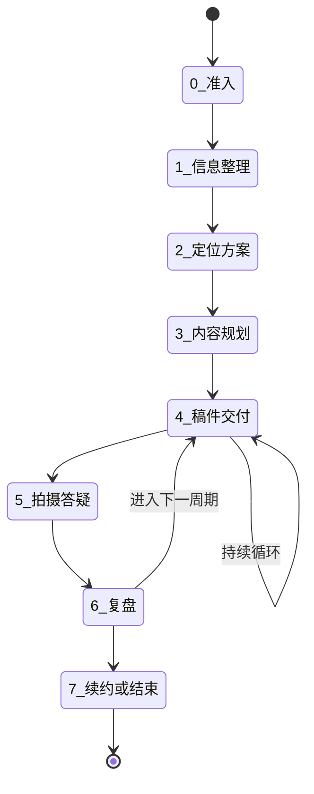

# 柯建军客户服务流程模板

## 这份文件是什么

这是**所有**客户接入工作台后,要走的服务流程模板。
当一个新客户(比如菲菲、若溪)接入时,
基于这份模板**复制一份到该客户的目录下**,做个性化调整。

模板覆盖从客户进入到持续服务的完整链路。

## 服务的 8 个阶段



**纯文字描述(给 AI 看)**:

服务流程包含 8 个阶段,顺序如下:
- 阶段 0:准入(收集客户基本信息和问卷)
- 阶段 1:信息整理(梳理原材料,生成客户画像)
- 阶段 2:定位方案(出账号定位)
- 阶段 3:内容规划(出第一批内容方向)
- 阶段 4:稿件交付(持续出稿,会循环多次)
- 阶段 5:拍摄答疑(客户拍摄遇到的问题)
- 阶段 6:复盘(每周或定期)
- 阶段 7:续约或结束

阶段 4 和阶段 6 之间会循环——
每次复盘后进入下一轮稿件交付,直到决定续约或结束。

## 每个阶段的详细定义

### 阶段 0:准入

**目标**:把陌生客户变成系统能服务的对象。

**输入**:
- 客户的购买行为(决定接入资格)
- 客户填写的问卷
- 柯哥与客户的初次沟通

**Hanako 做**:
- 把问卷答案结构化录入客户档案
- 把沟通记录归档
- 起草《客户画像-初版》

**柯哥做**:
- 验证客户画像
- 决定是否接入(有少数客户可能在这里被婉拒)

**Claudian 做**:不介入。

**小龙做**:cron 提醒柯哥"有新客户待处理"。

**完成标志**:
- 客户元数据.md 创建完毕
- 客户画像-初版完成

---

### 阶段 1:信息整理

**目标**:把零散的客户原材料,整理成可被方法论调用的结构化数据。

**输入**:阶段 0 的客户档案。

**Hanako 做**:
- 从问卷答案 + 沟通记录中提取关键信息:
  - 客户表达的核心痛点
  - 客户的优势和劣势
  - 客户的资源(经验、人脉、行业积累)
  - 客户的禁区(不愿意做的、不能碰的)
- 调出柯哥的方法论 MOC,标记可能相关的笔记
- 起草《信息整理报告》

**柯哥做**:
- 看报告,补充 Hanako 没看到的"客户暗信号"
- 决定要不要直接进入阶段 2

**Claudian 做**:
- 风险等级"中"以上时被柯哥召唤
- 抽查 Hanako 提取的关键信息有没有歪曲、漏掉

**完成标志**:
- 《信息整理报告》通过柯哥审核

---

### 阶段 2:定位方案 ⭐ 高风险阶段

**目标**:给客户的账号一个清晰的、独特的定位。

**这一阶段是整个服务的灵魂**。
定位错了,后面所有内容都白做。
所以这一阶段的审核必须最严格。

**Hanako 做**:
- 起草定位方案的"骨架":
  - 一句话定位(待柯哥注魂)
  - 受众画像(待柯哥注魂)
  - 内容支柱(待柯哥注魂)
  - 与同赛道差异化(待柯哥注魂)
  - 三个月内的内容方向(待柯哥起草)
- 标注 [AI 起草·待柯哥注魂]
- 风险等级标红,Will 段落明确写"建议召唤 Claudian"

**柯哥做**:
- 注魂(写所有"待柯哥注魂"的部分)
- 这是柯哥的核心价值,不可外包
- 完成后,文件移到 final/ 目录

**Claudian 做**:
- 必须召唤(高风险默认召唤)
- 抽查维度:
  - 语气:整篇是不是柯哥语气
  - 一致性:定位和客户画像是否对得上
  - 独特性:有没有不小心写成"通用方法论的复制品"
  - 风险:有没有让客户做他禁区里的事

**小龙做**:不介入定位决策,但在 cron 里跟踪交付时间。

**完成标志**:
- final/ 目录下有签字版定位方案
- status: delivered

---

### 阶段 3:内容规划

**目标**:基于定位方案,出第一批可执行的内容方向。

**Hanako 做**:
- 调出柯哥过往同类客户的内容规划(脱敏)
- 起草 8-12 个具体选题方向
- 每个方向标注:
  - 切入角度(待柯哥注魂)
  - 情绪刺点(待柯哥注魂)
  - 拍摄难度(Hanako 推测)
  - 与定位的关联(Hanako 推测)

**柯哥做**:注魂"切入角度"和"情绪刺点"。

**Claudian 做**:
- 风险中等,柯哥决定是否召唤
- 抽查"选题方向是否真的命中客户定位"

**完成标志**:final/ 目录下有签字版内容规划。

---

### 阶段 4:稿件交付 ⭐ 高频循环

**目标**:为客户的每条内容出稿子。

**这是消耗最多时间的阶段,也是 Hanako 减负价值最高的阶段**。

**Hanako 做**:
- 调出该客户的定位、内容规划、过往稿件
- 起草本条稿件:
  - **稿件正文**:用客户 IP 的语气写(标注 [AI 起草·IP 语气])
  - **柯哥点评空位**:留白,标注 [待柯哥点评]
- 列出本稿件的关键决策点:
  - 标题(3-5 个候选,待柯哥选)
  - Hook 开场(2-3 个候选,待柯哥选)
  - 灵魂段位置(标记好,待柯哥写)

**柯哥做**:
- 选标题、选 Hook
- 写灵魂段
- 写点评(如适用)

**Claudian 做**:
- 风险中,柯哥决定是否召唤
- 抽查重点:
  - **语气分层**:正文是 IP 语气、点评是柯哥语气,有没有混?
  - **三段式合规**:有没有 [AI 起草] 残留?

**完成标志**:final/ 目录下有签字版稿件,可交付给客户。

---

### 阶段 5:拍摄答疑

**目标**:客户拿到稿子去拍摄,遇到问题时给解答。

**Hanako 做**:
- 接收客户问题(从客户消息池.md 读取)
- 调出柯哥过往同类问题的答疑记录
- 起草回复初稿(柯哥语气)

**柯哥做**:
- 注魂回复
- 决定是否要补充新内容到课程或方法论

**Claudian 做**:不介入。

**完成标志**:回复发给客户(由柯哥手动发出)。

---

### 阶段 6:复盘

**目标**:每周或每个内容周期后,做一次完整复盘。

**Hanako 做**:
- 收集本周期的:
  - 内容数据(播放、互动、涨粉)
  - 客户反馈
  - 拍摄过程中的问题
- 起草《复盘报告》(柯哥语气):
  - 数据观察(Hanako 整理)
  - 关键判断(待柯哥注魂)
  - 下一周期策略(待柯哥注魂)

**柯哥做**:
- 注魂关键判断和下一周期策略
- 决定是否要修订客户的定位

**Claudian 做**:
- 抽查 Hanako 的数据观察是否准确
- 抽查"下一周期策略"是否真的从数据中推出来,而不是套路

**完成标志**:
- final/ 目录下有签字版复盘报告
- 触发新一轮的阶段 4(进入下一周期)

---

### 阶段 7:续约或结束

**目标**:决定继续服务还是结束合作。

**这一阶段完全由柯哥决定,Hanako 和 Claudian 不介入**。

**Hanako 做**(且仅做):
- 整理本服务周期的全部交付物
- 整理客户反馈聚合分析
- 起草一份《服务总结》供柯哥参考

**柯哥做**:决定。

## 阶段之间的状态流转规则

参见 [[02-协作规则/三AI协作宪章]] 中的"铁律 2:状态由 frontmatter 决定"。

每次状态变化,都体现在客户元数据.md 的 `service_status` 字段:

```yaml
service_status: 阶段0-准入
service_status: 阶段1-信息整理中
service_status: 阶段2-定位方案-ai已起草
service_status: 阶段2-定位方案-柯哥注魂中
service_status: 阶段2-定位方案-已交付
service_status: 阶段3-内容规划-ai已起草
... (以此类推)
```

## 这份模板的修订

这份模板是 v0.1。
预计 MVP 阶段会快速迭代:
- 跑通菲菲后调整一次 → v0.2
- 跑通第二个客户后调整 → v0.3
- 第三个客户接入后稳定 → v1.0

每次调整必须 git commit 留快照。