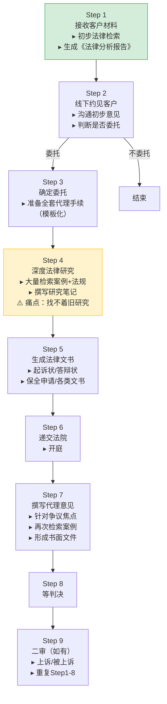
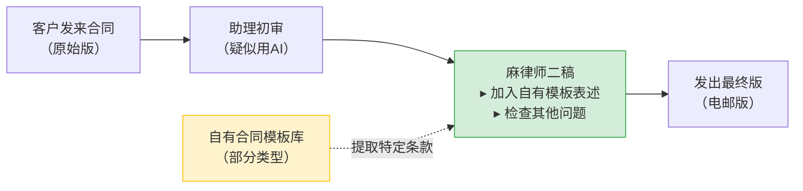
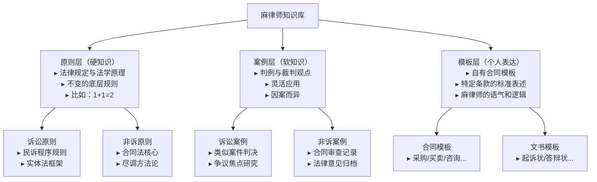
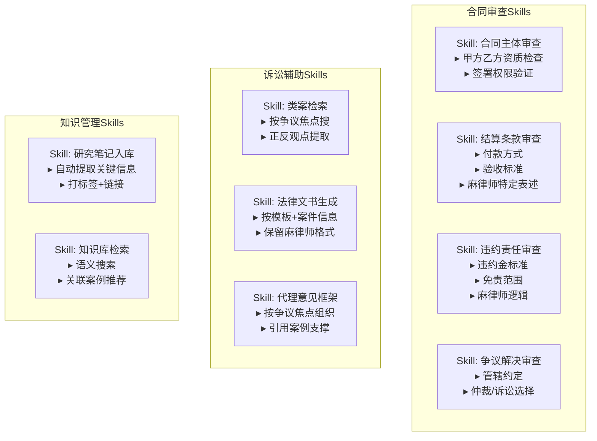

# 麻律师工作流思维导图

> 基于语音转文字整理版绘制。含改进建议备注。

---

## 总览 · 三大系统

```
┌─────────────────────────────────────────────────────┐
│                   麻律师工作流                        │
├─────────────────┬───────────────┬───────────────────┤
│   诉讼工作流      │  非诉工作流    │   知识库系统       │
│  (民商事诉讼)     │ (合同+法律意见) │ (原则+案例+模板)   │
└─────────────────┴───────────────┴───────────────────┘
```

---

## 一、诉讼工作流（9步）



### 各步骤详细说明

| 步骤 | 输入 | 输出 | 工具/方式 |
|------|------|------|-----------|
| S1 初步分析 | 客户材料 | 法律分析报告 | 人工检索 + 经验判断 |
| S2 约见 | 分析报告 | 委托/不委托决定 | 线下面谈 |
| S3 代理手续 | 委托确认 | 全套代理文件 | 模板 |
| S4 深度研究 | 案件材料 | 研究笔记（文稿） | 大量检索 ⚠️ |
| S5 法律文书 | 研究结论 | 起诉状等 | 格式规范 + 定制内容 |
| S6 开庭 | 法律文书 | 庭审记录 | 出庭 |
| S7 代理意见 | 庭审焦点 | 代理意见书 | 再检索 + 再研究 |
| S8 判决 | — | 判决书 | 等待 |
| S9 二审 | 一审判决 | 二审全部材料 | 重复流程 |

---

## 二、非诉工作流（合同审查）



### 当前文件存储结构（OneDrive）

```
合同审查/
├── 合同A/
│   ├── 客户原始版
│   ├── 助理修改版
│   └── 麻律师电邮版
├── 合同B/
│   ├── ...
├── ...
└── 模板/
    ├── 买卖合同（有自有模板）
    └── 咨询合同（无自有模板，希望AI生成）
```

---

## 三、知识库系统架构



### 知识复用逻辑

```
诉讼原则 ──── 共用部分？ ──── 非诉原则
    │          （如：合同法基础）        │
    ├── 独有原则123           ├── 独有原则123
    │   （民诉程序等）          │   （尽调方法等）
    │                          │
    案例层 ← 各自独立 →       案例层
```

---

## 四、AI Skill 拆分思路



---

## 五、改进建议 & 备注 ⚠️

### 🔴 高优先级

**1. 案例研究检索黑洞——ROI最高的修复点**

麻律师最大的资产不是合同模板，是她每个案子做的**研究笔记**。
现在写了就丢在电脑里找不着——这是一个纯知识管理问题，和AI能力无关。

**建议**：
- 为每个研究笔记建立统一模板（frontmatter：案由、争议焦点、正反观点、判决结果、法院层级、日期）
- 用Obsidian的wikilink把相关研究串联（比如"询证函效力"链接到"证据规则"）
- AI的检索Skill优先对接这个结构化研究库，而不是去外网从头搜

**一句话**：先把自己的研究笔记能找着，再谈AI加持。

---

**2. 合同入库策略——模板 vs 全量，答案是"都不是"**

麻律师纠结"只放模板还是每份都放"——这是假问题。正确的颗粒度是：

| 放什么 | 不放什么 |
|--------|----------|
| ✅ 自有模板（带她的表述逻辑） | ❌ 每一份客户原始版合同 |
| ✅ 她修改过的关键条款（提取出来） | ❌ 仅改了几个字的重复合同 |
| ✅ 特殊/复杂合同的完整修改过程 | ❌ 助理的中间版本 |

**操作方式**：每改完一份合同，花30秒标注"这份合同里我改了什么和别人不一样的"，积累100份就能训练出她的修改模式。不需要一万份。

---

**3. 助理AI使用是黑箱**

麻律师怀疑助理直接丢AI改合同，但她不控制这个过程——助理用的是什么提示词？AI改出来助理有没有检查？

**建议**：
- 把"助理→AI"这一步收回来，变成统一的知识库Skill
- 明确：审查主体用这个Skill，结算条款用那个Skill
- 助理用同样的Skill、同样的知识库，输出质量可控
- 麻律师只需要做"终审"——加自己的表述和判断

---

### 🟡 中优先级

**4. 诉讼流程缺少复盘节点**

现在诉讼走完→拿判决→下一个案子。没有"这个案子为什么赢/输"的复盘环节。

**建议**：在Step 8（等判决）和Step 9（二审）之间，加入一个复盘步骤：
- 我方主张被采纳了哪些？为什么？
- 哪些没被采纳？下次怎么调整？
- 这个案件的争议焦点，是不是之前研究里漏掉的？

这些复盘直接入库，比写完研究笔记更值钱。

---

**5. 模板库不完整但可以自生长**

麻律师有些合同类型有模板（采购），有些没有（咨询）。她想要AI帮她写没有模板的。

**建议**：
- 现有模板 → 告诉AI"这是麻律师的写法"，作为风格参考
- 没有模板 → AI从她改过的同类型合同中提取她的修改模式
- 每次改了一个新类型合同 → 自动提取关键条款 → 下次就有了"伪模板"

这个不需要麻律师主动"做模板"，系统从她的修改历史里长出来。

---

**6. 知识库"建了不用"的根因**

麻律师说"我不知道建完知识库能怎么用它"——这个问题的本质是：她没有定义知识库的**调用场景**。

**知识库不是搜索引擎，是AI的工作记忆。** 它的调用场景应该是：

| 场景 | AI该做什么 |
|------|-----------|
| 审查一份合同时 | 自动检索相似合同+麻律师的修改记录+相关模板 |
| 写起诉状时 | 检索类似案由的研究笔记+胜诉案例的代理意见 |
| 接到新案子时 | 检索法律分析报告模板+类似案由的全部研究 |

没有调用场景，知识库就是一个高级网盘。

---

### 🟢 低优先级

**7. 非诉业务还有"法律意见/尽调"没展开**

麻律师重点描述了合同审查流程，但非诉业务还包括常年法律顾问咨询和专项尽调。这两块的流程目前是空的，建议后续补充。

---

**8. 研究笔记的结构化入库是AI可做的**

麻律师现在做出研究笔记的流程是：搜案例→下载判决→写分析报告。AI完全可以帮她做：
- 自动从判决书提取"法院认为"部分
- 自动对比不同判决对同一问题的认定差异
- 生成第一版分析框架，麻律师只需要审+改

---

## 六、优先级行动清单

| 优先级 | 动作 | 预期效果 |
|--------|------|----------|
| 🔴 P0 | 建立研究笔记统一模板 + 入库流程 | 解决"找不着"的核心痛点 |
| 🔴 P0 | 定义知识库的4个核心调用场景 | 从"建了不用"到"每次都用" |
| 🔴 P1 | 合同修改记录提取（30秒/份） | 积累素材，训练风格 |
| 🟡 P2 | 助理AI使用统一化（共用Skill+知识库） | 质量可控 |
| 🟡 P2 | 诉讼流程加入复盘节点 | 经验系统化沉淀 |
| 🟢 P3 | 模板自生长机制 | 长期积累，减少空白 |
| 🟢 P3 | 研究笔记AI辅助生成 | 提效，但先做P0 |

---

## 相关链接

- [[律师-工作流设计_整理版]]（原始转写整理）
- [[00-麻律师-基本信息整理]]
- [[麻律师的语言风格指南]]
- [[法律行业知识提取-从麻律师实战中学到的]]
