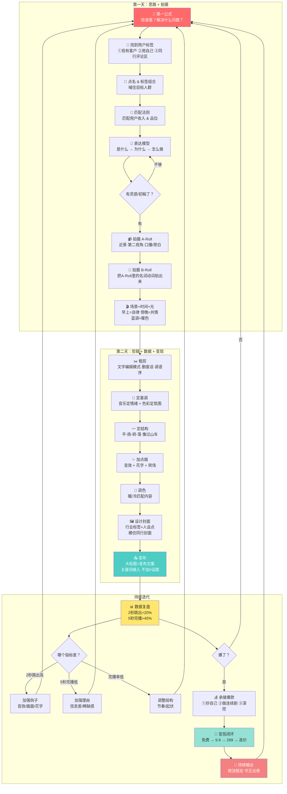

# 399拍剪实战课 · 两天完整流程整合

> 课程定位：两天教会拍剪基本功 + 背后思路。拍剪是最容易学的，但账号的核心是背后的思路。

---

## 一、课程总览

| | 第一天 | 第二天 |
|---|---|---|
| **主题** | 拍之前想清楚 + 拍摄技法 | 剪辑全流程 + 数据复盘变现 |
| **核心公式** | 给谁看？解决什么问题？ | 画面 + 文字 + 声音 + 数据反哺 |
| **实操** | 下午拍素材 | 带素材进剪辑 + 出一条成片 |

---

## 二、第二天语音识别主要错误修正

> 第二天由剪映自动字幕导出，语音识别错误严重，以下为重点修正。`【】`内为修正标注。

| 序号 | 原文（识别错误） | 修正 | 依据 |
|------|-----------------|------|------|
| 1 | 选点AI | 剪映AI | 剪辑软件名称 |
| 2 | A6和A6 / 文化 | A-Roll和B-Roll | 视频术语，第一天已讲过 |
| 3 | 半导体复杂比较细 | 大标题（关键词标签） | 上下文：告诉算法视频内容 |
| 4 | 比亚迪的对话 | ⚠️ 存疑：可能是"数据分析面板" | 上下文：展示评论区数据功能 |
| 5 | 自我毁灭 | 花字（花式字幕） | 后期术语 |
| 6 | 积极担当 | 基调（BGM基调） | 上下文：音乐定视频情绪基调 |
| 7 | 空洞 | 空洞音效 | 非真实声音（悬疑/科幻音效） |
| 8 | AP广告 | AD广告（信息流广告） | 第一天已出现过 |
| 9 | 粉色剪辑 / 文字填充 | 粗剪（文字编辑模式） | 剪辑流程第一步 |
| 10 | AI修饰图形 | AI智能剪口 / 智能填充 | 剪映AI功能 |
| 11 | 前台夫 / 钱付 | 前夫 | 案例角色 |
| 12 | 冰点的关系 | 冰点的（亲子）关系 | 关系冷到冰点 |
| 13 | 聊天文娱 / 中央文旅 | ⚠️ 存疑：可能是某文旅账号 | 2秒钩子案例 |
| 14 | 信息被被封控 | 信息差效应 / 沉没成本效应 | 心理学效应 |
| 15 | 葛城 | 高客单价 | 留存→转化逻辑 |
| 16 | 大耳朵 | ⚠️ 存疑：可能操作指引 | 课堂互动指令 |
| 17 | 心八 | 新号 | 账号生命周期 |
| 18 | 东北渔具 | 东北雨姐 | 抖音知名案例 |
| 19 | 被企业改革家们 | 被前夫赶出家门 | 赵姐案例 |
| 20 | 印花 | 一句话 | 测文案钩子 |
| 21 | 28个亿/2.9/9900 | 价格梯度（9.9→299→9900） | 变现路径 |

---

## 三、完整知识体系（两天融合）

### 模块一：拍摄前的思考（Day1上午 · 核心心法）

#### 1.1 第一公式：给谁看？解决什么问题？

拿起手机拍之前，必须回答两个问题：
- **这条视频给谁看？**
- **这条视频要解决他的什么问题？**

> 掌握这个公式后，具体用什么手法（站着说、走着说、偷拍、花字）都是随意的——因为核心已经定了。

#### 1.2 点名技法

先点名，喊住目标人群。用多维标签框定对方：

- 年龄 + 身份：40岁中年女性 / 35岁宝妈 / 45岁企业高管
- 状态 + 痛点：内耗的 / 焦虑的 / 迷茫的 / 在家庭中不幸福的
- 行业 + 收入：月入百万的律师 / 年入千万的企业家

**示例钩子：**
- "我从来没想过，月收入过百万的律师也会内耗。"
- "年收入过千万的家庭，也会出现冷暴力。"
- "40岁的姐姐们，别慌，你经历过的我都经历过。"

#### 1.3 如何找到用户标签（三种方法）

| 方法 | 怎么做 | 适用场景 |
|------|--------|---------|
| ① 从现有客户中找 | 拆客户标签→打乱重组→连线画图→编成真实案例 | 有真实客户的 |
| ② 用自己 | 把自己当对象→写详细标签→撮合自己 | 没客户的起步者 |
| ③ 去同行评论区找 | 看中腰部同行评论区→收集真实问题→转化为选题 | **最重要，所有人都能用** |

> "想吸引谁就编谁。所有人的痛苦都很雷同。"
> "博主的视频内容可能是编的，但评论区一定是真的——评论的人打了字，是真心想把问题告诉博主。"

#### 1.4 匹配法则

**匹配用户的收入和品位**，这是核心。

- 卖大几千课程 → 视频质感不能差，不能博眼球
- 先把自己想象成有钱人："我喜欢的视频质感是什么样的？"
- 深入到颜色、爱好匹配——内耗的人喜欢什么色？（偏冷、极简、黑灰）

#### 1.5 把观众想象成最难搞的客户

> "客户是极度刁钻、极度难缠、口味极刁、不好搞定的人。"

基于这个假设去想：用什么音乐？什么画面？什么语气？——困难越多，办法越多。

#### 1.6 基本表达模型

```
是什么 → 为什么 → 怎么做
```

- **是什么**：什么症状、什么问题
- **为什么**：为什么会这样
- **怎么做**：解决步骤（第一、第二、第三）
- **结尾**：点睛金句（不建议引导私信，要刺激他自己想点）

---

### 模块二：拍摄技法（Day1下午 · 动手）

#### 2.1 画面四要素

| 要素 | 核心要点 |
|------|---------|
| **构图** | 只学两种：居中构图（人放2/3处）、三分构图（左右黄金线） |
| **运镜** | 推拉摇移跟甩。核心理解：**所有运镜服务于信息** |
| **角度** | 第一视角（带着看）、第二视角（对着讲）、第三视角（客观拍） |
| **景别** | 远景（环境）、中景（动作）、近景（半身）、特写（局部）。**一定要多拍特写！** |

#### 2.2 A-Roll 和 B-Roll

| | A-Roll | B-Roll |
|---|---|---|
| **是什么** | 口播/旁白/录音——视频的声音骨架 | A-Roll里提到的名词和动词的画面 |
| **拍摄** | 近景（1倍）、第二视角、移/跟运镜 | 把A-Roll中的每个名词动词拍出来 |
| **作用** | 承载核心信息 | 让信息更可信、画面更丰富 |

> A-Roll 是骨架，B-Roll 是填空。先有声音，后有画面。

#### 2.3 场景 + 时间 + 光

| 时间 | 情绪 | 适合拍什么 |
|------|------|-----------|
| **早上（日出）** | 自律、向上、新希望 | 爬山、跑步、励志内容 |
| **白天** | 中性（没情绪） | 除非演技好，不推荐 |
| **傍晚/蓝调时刻** | 共鸣、共情 | 路边、咖啡厅、酒吧、深夜聊天 |
| **晚上** | 更深共情 | 烧烤摊、深夜独白 |

> **蓝调时刻 + 暖色 = 流量密码**。天色湛蓝（日落但天未黑），加上暖色灯光（路灯/台灯/招牌）。

> **回归常识**：讲自律必须早上，讲共情必须晚上。像跟闺蜜聊天一样拍，不是角色扮演。

---

### 模块三：用户细分+账号逻辑（Day2上午前半 · 思维深化）

#### 3.1 一条视频指向一类人群

每一条视频都要指向一个具体人群 → 多条视频叠加 → 形成账号人设和定位。

**匹配公式：**
```
一类人的需求 + 我的行业 = 一条视频的主题
```

#### 3.2 用户细分四步法

1. **搞清楚你是谁**：有客户的用客户拆，没客户的用自己拆，都不行就拆同行评论区
2. **人群画像越细越好**：越想越具体，越像真人
3. **别想太细（初学阶段）**：先关注前几秒能不能留住人
4. **匹配检查**：内容调性和目标用户的收入/品位配不配？

#### 3.3 账号的"垂"——垂人群，不是垂行业

> "你不是做一个科技博主、美业博主——你锤的是一群想变美的人。"

想变美的人→可能需要护肤品、需要疗愈、需要穿搭。基于人群，内容渠道就宽了，变现渠道也宽了。

**示例：**
- 疗愈账号：解决一部分人的情绪问题。情绪来源→亲子关系、夫妻关系、原生家庭、事业压力 → 内容可以从多个角度切入
- 创业账号：解决一部分人的创业问题。创业问题→没资金、没方向、没团队、没客户 → 每个角度一条视频

#### 3.4 账号进化策略：先测后深

```
先多角度测 → 发现某个角度爆了 → 持续深入这个角度
```

> "一旦发现某类内容流量爆了，就持续深入。不是绝对的，是动态的。"

---

### 模块四：剪辑全流程（Day2上午后半 · 核心实操）

#### 4.1 剪辑三要素

| 要素 | 包含什么 | 作用 |
|------|---------|------|
| **画面** | 拍摄素材、色彩、构图 | 质感、美感 |
| **文字** | 大标题、字幕、花字 | 人脑自动读字，引导注意 |
| **声音** | 人声、BGM、音效、白噪音 | 定基调、制造情绪 |

#### 4.2 声音层次（从外到内）

```
第一层：BGM（定调——开心/悲伤/共鸣/理性/大气）
第二层：音效（网感音效 + 高级电影音效）
第三层：白噪音（下雨/风声/车声/街道——真实环境音）
第四层：非真实声音（心跳/空洞/悬疑——营造氛围）
```

> 声音是有层次的——画面占30%，声音决定质感的另一半。分层次叠加，片子才立体。

#### 4.3 文字标签系统原理

**核心原则：尽量不干预，让算法自动识别。**

| 元素 | 作用 | 建议 |
|------|------|------|
| **大标题** | 告诉算法你在讲什么（作文题目） | 全文或部分时间显示 |
| **发布文案** | 概述内容（作文序言） | 写清楚，不写#话题 |
| **#话题标签** | 人工分类 | ❌ **不建议用** |
| **关键词植入文案** | 自然融入文案中 | ✅ 推荐：说话时自然带出 |

> **为什么不用#话题？** 算法会自动识别分类。加了#之后，如果内容跟话题不相关，算法会判定"货不对板"——反而不给流量。
> 
> **算法标签库**：2024年抖音内部标签近200万个。你只要把话说清楚，算法就能听懂。关键词自然植入文案比加#更有效。
>
> **自查方法**：在评论区右上角可以看到算法对这条内容的识别结果。

#### 4.4 抖音 vs 小红书：核心差异

| | 抖音 / 视频号 | 小红书 |
|---|---|---|
| **浏览方式** | 随机刷 | 点击选（先看封面标题） |
| **观众耐心** | 极低 | 相对高（主动选择的） |
| **核心指标** | 2秒跳出、5秒完播、留存 | 封面点击率 |
| **策略差异** | 全力钩住前5秒 | 封面标题做文章 |

#### 4.5 2秒跳出优化（五大技巧）

> 目标：2秒跳出 < 20%

1. **音效刺激**：加悬疑音效，制造不确定
2. **画面吸引**：放吸睛画面（快摔倒/刺激画面）
3. **花字标题**：直接给出痛点——"一条视频让你创业少走5年弯路"
4. **信息流骗术**：前2秒放解压/刺激画面（别常用，会伤账号）
5. **电影解说模板**：先勾勒悬念→切换到内容

#### 4.6 5秒完播优化

> 目标：5秒完播 > 45%

给观众**看下去的理由**——利用沉没成本效应：

> "看完这条视频，你将获得我8年创业的6条血泪教训。"
> "这是我服务200个客户总结出来的经验。"
> "一条视频让你避免17年失败的婚姻。"

#### 4.7 留存结构设计

```
2秒（钩住） → 5秒（给理由） → 5-7秒（新刺激） → 7-20秒（建立粘性） → 中间（深入） → 结尾（金句）
```

> 观众付出时间越多，对你的耐心越多。结构要像过山车——有起有落，不能平淡。

---

### 模块五：剪辑实操六步（Day2下午 · 动手）

```
Step 1: 粗剪（删废话）
├── 文字编辑模式：只看文字，不管画面
├── 删减、调换语序（中国文字博大精深，调顺序=不同意思）
├── 本质：断章取义——筛选最有用的

Step 2: 确定基调（音乐+色彩）
├── 一个音乐定视频情绪基调
├── 激昂/紧张/煽情/理性 → 选对应BGM
└── 色彩偏暖/偏冷 → 匹配内容情绪

Step 3: 确定结构（节奏起伏）
├── 像四声一样：平-扬-转-落
├── 观众情绪要像坐过山车——不能平淡
├── 用音乐、音效、语气变化做起伏
└── 训练方法：用音乐节奏来带结构感

Step 4: 点缀（加血肉）
├── 加音效（网感 + 高级电影音效）
├── 加花字（关键信息、重点提醒）
├── 加转场效果
└── 检查美颜参数

Step 5: 调色
├── 高饱和/低饱和
├── 偏暖/偏冷
└── 匹配内容：讲温暖故事→偏暖，讲理性逻辑→偏冷

Step 6: 设计封面
├── 最快的方法：模仿——拆同行封面→配色+构图+文字风格
├── 封面文字 = 行业标签 + 人设点（缺一不可）
├── 发布文案 = 概述内容 + 植入关键词
└── 坚持打磨50条，封面一定会好
```

---

### 模块六：数据分析 + 自我迭代（Day2 · 收尾）

#### 6.1 数据不是评判，是反馈

> "数据不好，不是死刑。是告诉你哪里没做好，下次怎么改。"

**核心指标参考：**
- 两秒跳出：< 20%
- 5秒完播：> 45%
- 整体完播率：> 35%

> 不要迷信数据——数据是综合的，不是看单一指标。算法是机器，不是人。

#### 6.2 流量层级

```
0 → 500（新手池 · 信号之间竞争）
  ↓ 表现好
500 → 1000
  ↓
1K → 2K → 5K
  ↓ 过5K
人工审核介入 → 更大流量池
```

> 稳定在1万播放以上→进入人工审核阶段。这时要考虑社会价值观、供需关系、平台导向。

#### 6.3 自我迭代方法

每次视频发完 → 看数据分析 → 定位问题：
- 两秒跳出高 → 下次加强钩子（音效/画面/花字）
- 5秒完播低 → 下次加强"看下去的理由"
- 完播率低 → 下次调整结构节奏

---

### 模块七：变现闭环（Day2 · 终极）

#### 7.1 核心认知

> **短视频的核心不是流量，是变现。**
> **挖需求 → 提供方案 → 收钱。前半句做到，后半句做不到 = 没钱。**

#### 7.2 变现金字塔

```
免费内容（引流）
  ↓
9.9 元（建立信任 · 低门槛认识你）
  ↓ 超值交付：让对方觉得9.9超值
299 元（1对1电话 · 深度了解需求）
  ↓ 在电话中继续销售
更高客单价（系统服务 · 8,000-10,000+）
```

> "9.9不是卖个便宜东西，是建立期待。让他们期待你后续的产品。"

#### 7.3 承接爆款的三种方法

| 方法 | 怎么做 | 原理 |
|------|--------|------|
| **① 抄自己** | 分析哪句话/哪个点爆了→反复用 | 爆过的内容就是验证过的 |
| **② 做连续剧** | 一个故事分多集→每集结尾留悬念 | 短剧逻辑：永远在"要说了又不说完" |
| **③ 深入主题** | 爆了的话题往深挖→讲细节→讲观点→讲方法论 | 一条爆款可以拆成N条 |

#### 7.4 闭环全貌

```
发视频 → 吸引精准人群 → 评论区/私信挖需求 → 
低价产品建立信任 → 电话深度沟通 → 高价服务成交
```

---

### 模块八：账号生命周期

| 阶段 | 特征 | 策略 |
|------|------|------|
| **新号启动** | 30小时内平台给机会 | 视频质量合格就能进下一个流量池 |
| **新手期** | 0-500播放竞争 | 坚持发，按流程做 |
| **成长期** | 偶尔爆款 | 承接爆款→连续剧+抄自己 |
| **成熟期** | 稳定1万+播放 | 考虑平台价值观和供需 |
| **老号重启** | 停更6个月以上 | 重新激活=新号待遇 |
| **废号** | 持续发低质内容 | 建议隐藏旧内容或重开 |

> **不依赖一条爆款**：持续按流程做，准时准点发。"守正出奇"——先把基本功做好，爆款自然会来。

---

## 四、完整流程图



---

## 五、关键金句备忘录

| # | 金句 | 所属模块 |
|---|------|---------|
| 1 | "拍剪是最基础的，也是最容易学的。账号的核心是背后的思路。" | 课程定位 |
| 2 | "给谁看？解决什么问题？——这个公式掌握了，用什么手法都是随意的。" | 核心公式 |
| 3 | "博主的视频内容可能是编的，但评论区一定是真的。" | 找用户标签 |
| 4 | "一个人的幸福可能不太一样，但痛苦都很雷同。" | 用户标签 |
| 5 | "把观众想象成极度刁钻、最难搞定的客户。" | 匹配法则 |
| 6 | "蓝调时刻 + 暖色 = 流量密码。" | 拍摄场景 |
| 7 | "一定要多拍特写——特写是信息密度最高的东西。" | 景别 |
| 8 | "你不做一个科技博主，你锤的是一群想变美的人。" | 账号定位 |
| 9 | "先多角度测，哪个爆了就往深挖。" | 账号策略 |
| 10 | "视频结构要像过山车——有起有落，不能平淡。" | 剪辑结构 |
| 11 | "不要加#话题标签，让算法自动识别。" | 发布技巧 |
| 12 | "短视频的核心不是流量，是变现。" | 变现 |
| 13 | "挖需求 → 提供方案 → 收钱。前半句做到，后半句做不到 = 没钱。" | 变现 |
| 14 | "数据不是评判，是反馈。" | 数据复盘 |
| 15 | "守正出奇——先把基本功做好，爆款自然会来。" | 整体策略 |
| 16 | "回归常识——像跟闺蜜聊天一样拍，不是角色扮演。" | 拍摄状态 |

---

## 六、课后任务清单

| # | 任务 | 来源 |
|---|------|------|
| 1 | 每人找50个同行博主，每人拆3条最爆的视频，共150条 | 第一天 |
| 2 | 按"给谁看？解决什么问题？"思路自己写一条 | 第一天 |
| 3 | 下午拍素材，第二天带素材进剪辑 | 第一天→第二天 |
| 4 | 按六步剪辑法剪出一条成片 | 第二天 |
| 5 | 发布后看数据，定位问题→下一次迭代 | 第二天 |

---

## 相关链接

- [[6月9日-399课程-整理版-第一次上课]]
- [[6.10日-399课程-第二次上课]]
- [[🗺️ 短视频创作流程地图（导航版）]]
- [[剪辑_视频生产五步流程]]
- [[拍摄实操全景图-燕窝稿案例]]
- [[课程产品-399拍剪实战课-美团抖音团购详情]]
