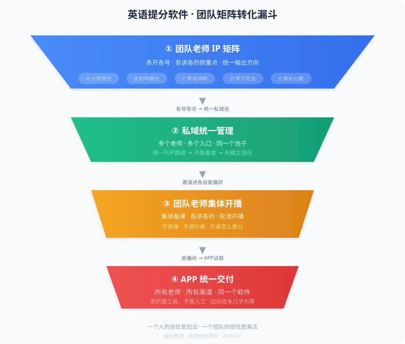

# 英语提分软件 · 短视频运营方案

高老师，你好，

先跟你说句实话：你的品类，跟大部分人做短视频的路子不一样。
别人可以靠拍视频攒粉丝、靠自然流量卖货——你不适合这条路。
不是你的问题，是你的产品决定的。

我做过招商、做过无人机项目——跟你一样，都不是"靠播放量吃饭"的品类。
招商那个，5个月干了近200万；
无人机那个，2000粉做到300万业绩。
靠的都不是粉丝多，是路径对。

下面我把适合你的路径讲清楚。

---

## 一、为什么你不能走常规路线

英语提分软件在抖音上，天然有两道坎：

**第一道：政策。** 教育类在公域审核越来越严，付费投流容易被卡。跟猿辅导那些大厂比，它们有资质、有预算，你没有。

**第二道：信任。** 家长掏钱买一个软件，不是刷到一条视频就下单的——他不认识你、不了解效果、不知道售后服务。这跟买口红完全是两回事。

所以你的路不是"拍视频→涨粉→卖货"，这条路对你走不通。

你的路是：**先让人认识你、信任你，再在私域里成交。** 这不是退而求其次，这是品类最对的打法。

---

## 二、一个人不够，得团队矩阵

我跟你说个很多人忽略的点：靠一个人的IP是不行的。

一个老师，能讲的内容有限。关注你的人都是同一个风格的，家长看腻了就不看了。而且万一这个人状态不好、不想拍了，整个链路就断了。

你要做的是：**团队里的老师都上。** 集体上课、集体做内容。每个人分一个侧重点，各开各的号。但背后的私域管理和最终交付，是统一的。

### 第一步：团队老师集体做IP

不是一个人扛着。是你团队里能讲英语的老师，一人一个号。

**分侧重点：**

| 老师 | 方向 | 讲什么 |
|------|------|--------|
| A老师 | 小学提分 | 单词怎么背、听力怎么练、家长怎么盯 |
| B老师 | 初中提分 | 语法怎么破、完形填空、阅读理解 |
| C老师 | 考试冲刺 | 中高考前三个月怎么冲、真题怎么用 |
| D老师 | 学习方法 | 为什么孩子背了忘、怎么科学记单词 |

每个老师只讲自己那块，内容不打架。但所有人的内容都围绕同一个关键词：**提分。**

家长在抖音上刷到A老师觉得不错，过两天又刷到B老师——两个人都在讲提分，都用你们的方法论。这时候家长心里想的不是"这个老师挺好的"，而是**"这家机构的老师都挺专业的"。**

一个人的信任是加法，一个团队的信任是乘法。

每个人怎么拍、讲什么、用什么钩子，我统一出方向和脚本。你们照着拍就行。

### 第二步：私域统一管理

每个老师的账号底下都放钩子——

- "你家孩子在英语上是不是也有这个问题？私信我"
- "我整理了一份英语核心词汇表，需要的家长私信"
- "不知道孩子卡在哪？来直播间我帮你分析"

家长加微信之后，**不管是从哪个老师的视频过来的，进的是同一个私域池。**

统一SOP跟进：

1. 打招呼 → 确认孩子年级、英语成绩
2. 免费测评 → 分析弱项（这个测评用你的软件做）
3. 给出建议 → 不急着卖，先解决问题
4. 适时推试用 → "这个软件先让孩子用一周"

背后是同一套话术、同一套流程。不靠每个老师的个人能力，靠系统。

### 第三步：团队老师集体开播

每个老师每周固定时间直播。内容不用重新准备——**集体备课，各讲各的。**

- 周一：A老师讲"小学英语怎么入门"
- 周三：B老师讲"初中英语怎么从60提到90"
- 周五：C老师讲"距离高考还有X个月，怎么规划"

一个人直播撑不住，五个人轮着来，节奏就拉起来了。

直播不讲价格、不卖课。就讲方法。家长听了觉得有用，自然会问"你说的这个软件在哪买"。

这一步是做信任的最后一道工序：视频看完觉得你专业，直播听完觉得你靠谱。

### 第四步：APP统一交付

这个是最关键的一点：**所有老师、所有渠道、所有私域，最后导入同一个APP。**

你的品是个软件，不是人工辅导。这意味着：
- 多卖一个用户，成本几乎为零
- 不需要养一个庞大的班主任团队
- 软件就是你的班主任：测评、练习、纠错、进度跟踪，全在里面

家长买了软件，孩子自己用。效果出来，家长续费、转介绍。私域的作用不是天天催你续费，是**让你在孩子遇到问题的时候，第一时间想到回来找我们。**

---

## 三、案例：类似的路径我跑通过

### 案例一：招商项目

做的是全国招商，不是本地生意。品类跟你一样——不是刷到就下单的东西，需要深度信任。路径是：矩阵账号立人设 → 私域沉淀 → 直播加速信任 → 一对一跟进成交。

结果：5个月做到近200万。**账号粉丝不多，但加到私域的都是精准客户。**

### 案例二：无人机创业项目

一群大学生从0开始做，2000粉丝的时候已经变现，11万粉的时候业绩300万。路径也是：矩阵账号展示专业度 → 直播建立信任 → 私域成交。

**这两个案例说明同一件事：你的品类，粉丝量不重要。团队作战、路径对，才重要。**

---

## 四、我怎么带你做

不是教你一个人拍视频。是带你整个团队把这条链路搭起来。

我的方式：**我出策略 + 出矩阵分工 + 出脚本模板 + 出私域SOP，你带着团队执行。**

陪跑1-3个月，目标是跑通整条链路至少一遍。具体节奏：

| 阶段 | 时间 | 做什么 |
|------|------|--------|
| 搭建期 | 前2周 | 团队老师定位分工、各号搭建、出第一批内容（每人3-5条） |
| 引流期 | 第3-4周 | 优化各号内容方向、测试钩子话术、搭建私域SOP |
| 转化期 | 第2-3月 | 老师轮流开播、私域SOP跑起来、完成第一批APP成交 |

---

## 五、你现在可以开始做的事

1. **盘点团队老师**：能出镜讲英语的老师有几个？各自擅长什么？（小学/初中/听力/阅读/考试冲刺）
2. **整理教学理念**：你们的提分方法论是什么？为什么有用？——我等下给你出内容
3. **准备APP试用流程**：家长下载之后，怎么引导第一次使用？怎么让他看到效果？

等你把这些发过来，我们再安排时间，统一学习，统一执行。

---

迪派教育 · 柯建军 · 2026.07
