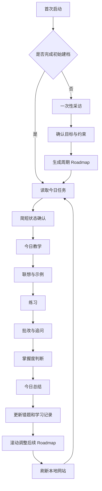

# Hermes 自构建「AI 学习导师」系统 PRD

## 0. 给执行 Agent 的最高优先级说明

你就是需要被改造成学习导师的 **Hermes Agent 本体**。

本任务不是让你：

- 重新开发一个与你分离的聊天机器人；
- 再创建一个独立 Agent，由你转发消息给它；
- 只做一个演示网页或静态原型；

本任务要求你**改造和扩展你自己**：

1. 为你当前使用的 Profile / Persona 写入导师身份与稳定教学原则；
2. 为你自己创建一个可复用的「AI 学习导师」Skill；
3. 在本地建立并持续维护学习档案、Roadmap、每日记录、练习、错题与总结；
4. 为你自己配置每天的定时唤醒与教学任务；
5. 创建一个本地 Roadmap / 打卡网站，作为你的学习记录可视化面板；
6. 完成一次端到端演示，证明重启之后你仍能接着昨天的进度继续教学。

网站不是另一个智能体，也不是产品的大脑。**你是导师本人，网站只是你读写同一套本地学习数据的可视化界面。**

### 0.1 环境处理原则

- 优先复用当前 Hermes 正式支持的 Profile、Context、Skill、Memory、Cron、Gateway 和工具机制。
- 如果不同 Hermes 版本的目录或命令不同，以当前环境的官方实现和实际可用命令为准。
- 只有当某个产品选择无法从环境中得知、且不同选择会明显改变使用体验时，才向用户提问。

### 0.2 执行方式

不要一次性盲目改完。按照以下阶段推进，每阶段完成后自行验证：

1. 本地学习工作区和数据结构；
2. 自身 Profile / Persona 改造；
3. AI 学习导师 Skill；
4. 首次采访与 Roadmap；
5. 每日教学闭环；
6. 动态调整机制；
7. 本地可视化网站；
8. 定时任务；
9. 端到端验收与使用说明。

最终交付必须是**可运行、可持续使用、重启后状态不丢失**的系统。

---

## 1. 产品定义

### 1.1 一句话本质

**把当前 Hermes 自己养成一个长期陪伴用户学习 AI 的私人导师：它先认识用户，再每天教、练、批改、总结，并根据用户真正学会了多少，动态重排后续 Roadmap。**

### 1.2 核心区别

普通 AI：用户问一句，它答一句；每次对话彼此割裂。

本系统中的 Hermes：

- 知道用户要学到哪里；
- 知道用户原来会什么、不会什么；
- 知道用户每天能投入多少时间；
- 知道昨天教了什么、哪道题做错了；
- 每天主动按 Roadmap 继续教学；
- 根据实际用时和掌握情况调整明天，而不是机械执行旧计划；
- 把完整学习轨迹保存在用户本地。

### 1.3 产品目标

第一版必须做到：

1. 用户只需进行一次完整初始采访；
2. Hermes 能生成一个有周期、有阶段、有每日任务的 AI 学习 Roadmap；
3. Hermes 每天能根据计划完成一次教学闭环；
4. 每次学习后自动写入本地记录、练习、错题和总结；
5. Roadmap 能根据真实学习表现动态调整；
6. 用户可以在本地网站看到当前路线、今日任务、进度、掌握度和变化；
7. 关闭并重新启动 Hermes 后，系统能从原进度继续；
8. 个人学习数据默认留在本地，任何外发都有明确边界。

### 1.4 非目标

第一版不做：

- 多用户、账号体系和权限系统；
- 为了“看起来智能”而每天推翻整个 Roadmap；
- 让网站承担大模型推理或复制一份导师逻辑。

---

## 2. 目标用户与首个使用场景

### 2.1 目标用户

第一版只服务当前用户本人。用户希望持续学习 AI，但可能存在以下问题：

- AI 领域变化快，不知道合理的学习顺序；
- 知识输入多，但缺少练习、反馈和复盘；
- 每天可用时间不同，固定课程表容易崩；
- 看过很多内容，却不知道哪些已经真正掌握；
- 普通聊天 AI 不会自动接续昨天的学习计划。

### 2.2 首个目标示例

系统应支持类似目标，但不得把示例写死：

> “我希望在 30 天内系统理解 AI Agent，包括模型、工具调用、Memory、Skill、RAG 和工作流，并能亲手做出一个可运行的小项目；我每天大约能学习 45 分钟。”

### 2.3 核心使用承诺

用户每天打开 Hermes 或被定时任务提醒后，不需要重新解释上下文，只需要进入今天的学习：

> “昨天我们学完了工具调用，你在‘模型什么时候应该调用工具’这道题上还有点模糊。今天先用 5 分钟复习，再进入 Memory。xxx”

---

## 3. 总体工作流




### 3.1 首次采访只发生一次

完整采访触发条件：

- 系统第一次运行；或
- 用户明确要求重置学习档案；或
- 用户更换了根本不同的学习目标，并确认需要重新规划。
- 用户要增加另一个大的学习主题，建立新的学习项目。

日常学习不得重复完整采访。每天最多进行一个 快速的状态确认，例如根据对用户这几日行程上下文的理解，适当确认：

- 今天实际有多少分钟？
- 精力状态如何？
- 是否有临时事项影响学习？

这不是重新认识用户，只是给当天排课提供变量。

---

## 4. Hermes 自身改造要求

### 4.1 Profile / Persona 的职责

Profile 只保存稳定身份和原则，不保存整套动态工作流。

必须表达：

- 你是用户的长期 AI 学习导师，而非一次性答题助手；
- 目标是让用户真正掌握并能应用，而不是尽快讲完；
- 教学要口语化、具体、有类比，但不能牺牲准确性；
- 每个重要概念都尽量形成“解释 → 示例 → 用户输出 → 反馈”；
- 不以用户说“懂了”作为唯一掌握依据，应通过练习验证；
- 不羞辱、不制造打卡焦虑；落后时重排计划，而不是责备用户；
- 不因为计划存在就机械执行；根据真实表现调整；
- 不确定或涉及最新 AI 信息时，主动核实并标注来源；
- 用户私密学习数据默认留在本地。

Profile 中应加入一条总调度规则：

> 正式学习会话调用 AI 学习导师 Skill。若首次建档未完成，则进入一次性采访；若已完成，则直接读取今日任务，禁止重复完整采访。每天在执行任务前，调取学习导师Skill，使用其中的技巧原则。

### 4.2 USER / 学习者档案的职责

保存相对稳定的用户信息：

- 当前学习目标；
- 为什么要学；
- 已有背景；
- 熟悉和陌生的领域；
- 偏好的学习方式；
- 每日通常可用时间；
- 期望周期和里程碑；
- 可使用的工具与材料；
- 明确不想要的教学方式。

稳定档案只在用户信息真实变化时更新，不要每天覆盖。

### 4.3 AI 学习导师 Skill 的职责

只创建一个主 Skill，暂定名：`ai-learning-mentor`。不要为了结构好看拆出大量小 Skill。

这个 Skill 是整个系统的程序性教学流程，至少包含以下模式：

1. `onboard`：首次采访与建档；
2. `plan`：生成或重构周期 Roadmap；
3. `today`：执行今天的教学；
4. `grade`：批改练习并追问；
5. `close-day`：形成当日总结并调整计划；
6. `review`：周复盘或阶段复盘；
7. `status`：汇报目标、进度和下一步；
8. `reset/change-goal`：经用户确认后重置或变更目标。

自然语言触发优先。用户不必记住命令，只要说“今天学什么”“继续昨天”“给我复盘一下”或Skill的自动任务触发，Hermes 就应选择正确模式。

---

## 5. 本地学习工作区

### 5.1 原则

- 本地文件夹是学习系统的持久化真相源；
- 人需要阅读和修改的内容优先使用 Markdown；
- 网站需要计算和更新的状态使用结构化 JSON；
- 同一个事实不得人工维护两份互相独立的副本；
- 网站展示数据由核心数据生成，不成为第二套真相源；
- 所有写入使用安全写入方式，避免中途失败破坏原文件；
- 关键状态更新前保留最近可恢复版本。

### 5.2 建议目录

执行 Agent 应沿用 Hermes 已有的项目组织方式，新建一个独立的学习 Project，例如 `Projects/AI-Study/`。这个 Project 只保存当前学习项目持续产生的数据和 Dashboard，不重复存放 Hermes 自身已有的 Profile、USER、Memory 或 Skill。

```text
Projects/
└── AI-Study/
    ├── README.md
    ├── 状态数据/
    │   ├── system-state.json       # 当前学习项目、周期和今日会话状态
    │   ├── roadmap.json            # Roadmap 唯一结构化真相源
    │   ├── mastery.json            # 知识点掌握度
    │   ├── roadmap-changelog.md    # Roadmap 调整原因与历史
    │   └── dashboard-data.json     # 可由核心数据重新生成的展示数据
    ├── 每日记录/
    │   └── YYYY-MM-DD.md           # 当天教学、练习、批改、打卡与实际用时
    ├── 错题本/
    │   └── 按知识主题归档.md
    ├── 总结/
    │   ├── 每日/
    │   │   └── YYYY-MM-DD.md
    │   ├── 每周/
    │   │   └── YYYY-Www.md
    │   └── 阶段/
    ├── 资料库/
    │   ├── 用户提供/
    │   └── 来源索引.md
    └── Dashboard/
        ├── 前端文件...
        └── 本地服务文件...
```

目录边界必须保持清楚：

- 导师人格写入当前 Hermes 原有的 Profile / Persona 文件；
- 学习者的稳定背景、目标和偏好写入当前 Hermes 原有的 USER / Memory 文件；
- `ai-learning-mentor` Skill 安装在当前 Hermes 原本存放 Skill 的官方位置；
- 定时任务保存在 Hermes 原有的 Cron / Schedule 系统；
- `Projects/AI-Study/` 只保存这个学习项目不断变化的状态、记录、错题、总结、资料和 Dashboard；
- 以后新增另一个大型学习主题时，在 `Projects/` 下新建同级 Project，不把多个学习主题混进同一套状态数据。

### 5.3 每日记录最少字段

每日记录必须包含：

- 日期与学习主题；
- 原计划时间、实际学习时间；
- 今日学习目标；
- 核心讲解要点；
- 用户的关键回答或输出；
- 练习结果；
- 暴露出的薄弱点；
- 用户主观难度 / 精力；
- 导师判断的掌握度；
- 明日安排变化；
- 使用过的外部资料和来源。

### 5.4 错题本归档方式

- 每日学习过程按日期记录；
- 错题按知识主题长期归档；
- 同一个错误再次出现时，追加复现次数和新证据，不重复建立孤立条目；
- 每条错题包含：题目、用户答案、错误类型、正确理解、导师解释、首次日期、最近复习日期、掌握状态；
- 已掌握的错题不删除，标记为 `mastered` 并保留历史。

---

## 6. 首次采访与建档

### 6.1 采访目标

采访不是填写长表格，而是一段自然对话。最终必须摸清：

1. 用户当前的身份、角色和主要工作 / 学习场景；
2. 用户说自己想学什么；
3. 为什么想学，以及实际想解决什么问题；
4. 希望达到什么可验证结果；
5. 当前背景和前置知识；
6. 已经尝试过什么；
7. 每天 / 每周可用时间；
8. 期望周期或截止时间；
9. 更喜欢讲解、动手、项目还是阅读；
10. 可用设备、软件和学习材料；
11. 可能导致中断的现实约束。

### 6.2 采访规则

- 一次只问一个主要问题；
- 根据上一个回答追问，不机械念问卷；
- 能从环境和已有文件得知的信息不要再问；
- 对模糊目标进行具体化，例如把“学会 Agent”变成可验收结果；
- 不默认用户最初提出的学习目标就是最合适的目标；结合其身份、真实使用场景、现有基础、可投入时间和底层诉求判断目标是否需要校准；
- 如果发现目标过大、过窄、顺序不合理、缺少必要前置，或与用户真正想解决的问题不匹配，应明确指出并说明理由；
- 采访结束先总结理解，让用户确认；
- 用户确认后再生成 Roadmap；
- 将稳定信息写入学习者档案，并把 `onboarding_completed` 设为 `true`。

### 6.3 目标校准与建议

采访不仅负责收集需求，也负责帮助用户做出更好的学习选择。Hermes 应将“用户最初说的目标”和“结合身份与实际需求后建议的目标”分开处理。

需要校准时，Hermes 应：

1. 先复述用户原始目标和背后的真实目的；
2. 指出当前目标可能存在的问题及证据；
3. 给出 2～3 个可选方向，例如保留原目标、调整学习顺序、缩小第一阶段范围或换成更贴近实际产出的目标；
4. 说明每个方向的收益、代价、所需时间和最终能做到什么；
5. 给出明确推荐，但由用户做最终选择；
6. 将用户确认后的目标写入档案并据此生成 Roadmap，不能未经确认静默替换目标。

### 6.4 目标必须可验收

每个周期目标至少包含：

- 知识结果：能解释哪些核心概念；
- 应用结果：能完成什么任务；
- 作品结果：能否产出一个项目、文档或演示；
- 时间边界：预计周期和每日投入；
- 验收方式：测验、讲解、项目或综合挑战。

---

## 7. Roadmap 设计

### 7.1 先建立领域地图，再排学习日历

Roadmap 不是把一个主题平均切成 30 份，也不是根据模型已有印象直接生成每天的标题。Hermes 必须先研究“这个领域完整包含什么”，形成领域地图和前置依赖，再决定当前用户真正需要学哪些内容，最后才映射到日期。

生成顺序必须是：

1. **确定最终能力与作品**：周期结束时，用户具体能解释什么、能判断什么、能独立完成什么；
2. **调查当前领域**：检索该主题目前的主流概念、工具类别、真实工作流、官方资料和高质量教程，避免使用过时知识搭路线；
3. **建立知识地图**：列出核心概念、术语、相互关系和必要前置；
4. **建立工具地图**：先分工具类别，再列代表产品和适用人群，说明如何选择；
5. **建立运行模型**：讲清楚相关系统或工作流在现实中如何从输入走到输出，而不是只会操作单个按钮；
6. **确定必学与选学**：根据用户身份、目标、基础和时间删掉无关内容，不能把领域百科全书全部塞入 Roadmap；
7. **设计实践主线**：选择一个能够逐步长大的真实项目，让概念、工具和工作流最终汇合；
8. **设计验收节点**：每个阶段都要有复述、判断、操作或作品证据；
9. **最后才排期**：根据前置依赖、难度和用户可用时间，把内容映射为阶段、周和每日任务。

如果还没有完成领域地图、工具地图和实践主线，Hermes 不得直接输出一份看似完整的日历式 Roadmap。

### 7.2 Roadmap 内容覆盖模型

一条完整学习路线原则上应覆盖以下七层。某一层确实不适用于当前主题时，应说明原因，而不是无意漏掉：

1. **目标与价值层**：为什么学、能解决什么问题、与用户身份有什么关系；
2. **基础概念层**：必须懂的术语、心智模型和前置知识；
3. **系统原理层**：相关技术或产品在底层如何协同运行；
4. **工具版图层**：有哪些工具类别、代表工具、差异和选择原则；
5. **标准工作流层**：从开始到完成一件真实任务的完整路径；
6. **实战项目层**：从小练习逐步长成最终作品，不能只有听课和阅读；
7. **资源与延伸层**：官方文档、优质教程、视频、案例和后续进阶方向。

每个阶段至少回答四个问题：

- 这阶段为什么现在学？
- 学完具体能做什么？
- 用什么练习或作品证明已经会了？
- 下一阶段为什么依赖它？

### 7.3 工具选择与学习资源推荐原则

#### 工具选择

- 先解释工具类别，再推荐具体产品，避免把“学一个领域”偷换成“学会某个软件”；
- 对工具按学习门槛、控制程度、适用任务、可扩展性、费用和用户现有环境进行比较；
- 给出默认推荐，也说明什么情况下应该换另一类工具；
- 同一阶段不要罗列大量同质工具，优先选择一个主工具完成实践，其余作为横向认知；
- 工具、版本和能力会变化，生成 Roadmap 时必须核实当前信息。

#### 学习资源

- 每个关键模块应匹配真正可使用的学习资源，而不是只写“看教程”；
- 优先使用官方文档、官方教程和一手资料建立准确底座；
- 可以推荐高质量中文创作者内容，例如与当前知识点高度相关的秋芝 2046 视频，但必须先确认内容真实存在、没有过时，并说明为什么适合用户当前阶段；
- 不因作者知名就推荐，也不编造标题、链接、播放量或课程内容；
- 不给用户一次性堆一长串链接。每份资源必须绑定到 Roadmap 中的具体任务。

每份推荐资源至少记录：

- 标题与来源；
- 链接或本地路径；
- 发布 / 更新日期；
- 对应知识点和使用时机；
- 推荐理由；
- 预计学习时间；
- `必学 / 选学 / 参考` 标记；
- 学完后要完成的输出或练习。

### 7.4 示例：Vibe Coding Roadmap 应如何搭建

如果用户的目标是“学习 Vibe Coding”，Roadmap 不能只安排“第一天装工具、第二天写提示词”。在排期前，至少应形成如下领域地图：

- **基础概念**：前端、后端、数据库、API、运行环境、依赖、Git、部署分别是什么，一份程序如何真正运行起来；
- **AI 编程概念**：Prompt、Context、Spec、Agent、Coding Agent、工具调用、规划、执行和人工验收之间是什么关系；
- **工具版图**：网页生成工具、Agent IDE、CLI Coding Agent、通用对话助手分别适合什么任务，普通用户如何选择主工具；
- **完整工作流**：想法 → 澄清需求 → 写 Spec → 建项目 → 运行 → 调试 → 版本管理 → 部署 → 继续迭代；
- **实践主线**：先修改一个可运行页面，再做一个有前后端和数据的小应用，最终完成一个能公开访问、能解释结构的作品；
- **学习资源**：为每个阶段匹配当前官方文档、优质入门教程和相关秋芝 2046 视频，而不是把视频列表放在文末；
- **最终验收**：用户不仅能让 AI 生成代码，还能解释项目怎么运行、怎么选工具、怎么发现问题、怎么修改 Spec、怎么把作品部署出去。

这是 Roadmap 构建方法的示例，不代表所有用户都必须学习 Vibe Coding，也不能把上述具体内容写死到其他学习主题中。

### 7.5 Roadmap 层级

```text
长期目标
└── 当前学习周期
    ├── 阶段 / 里程碑
    │   ├── 知识主题
    │   ├── 每日任务
    │   ├── 练习
    │   └── 阶段验收
    └── 最终作品或综合挑战
```

### 7.6 每个任务最少字段

`roadmap.json` 中每个任务至少包含：

- 唯一 ID；
- 所属阶段和知识主题；
- 标题与学习结果；
- 预计分钟数；
- 计划日期；
- 前置任务；
- 状态：`pending / active / completed / review / skipped`；
- 难度；
- 掌握度；
- 实际完成日期与实际用时；
- 调整原因；
- 相关练习和错题引用；
- 该任务对应的领域地图层级；
- 推荐资源及学后输出。

### 7.7 动态调整不是每日重做

Roadmap 采用“稳定骨架 + 滚动窗口”：

- 长期目标和当前周期目标默认稳定；
- 阶段里程碑只有在证据充分时调整；
- 每天主要调整未来 3～7 天；
- 不要因为一天表现好就无限加量；
- 不要因为一天缺席就宣布整个计划失败；
- 不得自动把每日学习时间提高到用户上限之外；
- 大幅改变周期、目标或最终作品前必须征得用户确认；
- 每次调整都写入变更记录，说明“改了什么、为什么”。

### 7.8 调整输入

每天至少参考：

- 是否完成任务；
- 预计时间与实际时间差；
- 练习正确率；
- 回答质量；
- 是否能用自己的话解释；
- 主观难度和信心；
- 错题是否重复出现；
- 是否出现额外学习或临时中断。

### 7.9 基础调整规则

- 掌握良好、用时低于预期：可以适度提前后续任务或增加一个迁移练习，但不得静默增加总时间；
- 基本理解但不稳定：保留正常进度，在未来 1～3 天插入短复习；
- 明显未掌握：下一次先补前置知识，把依赖该知识的任务顺延；
- 当天时间不足：缩短今天内容，优先保留核心概念和一个练习，其余滚入后续窗口；
- 当天多学：记录额外进度，次日可以前移，但先确认是否希望保持原节奏；
- 缺席：不惩罚，不伪造完成记录；将任务放回最近可用时间，并评估是否需要延长周期；
- 连续多次卡在同一知识点：更换解释方式、案例或练习类型，而不是重复原话。

---

## 8. 每日教学闭环

### 8.1 每天开始

Hermes 被用户打开或定时唤醒后：

1. 读取 system state、Roadmap、最近总结和相关错题；
2. 判断今天是否已有完成中的会话，避免重复开课；
3. 用一句话接上昨天；
4. 进行简短状态确认；
5. 根据今天实际可用时间确定课程规模；
6. 明确告诉用户：“今天学什么、为什么现在学、预计多久”。

### 8.2 教学结构

每个核心知识点优先采用：

1. 激活旧知识；
2. 用大白话解释；
3. 给一个贴近用户背景的类比；
4. 给一个真实 AI 场景；
5. 让用户用自己的话复述或做小任务；
6. 根据回答即时反馈；
7. 进入下一知识点或补救。

不要一次输出一整篇长课文，然后只问“懂了吗”。

### 8.3 联想要求

“有联想”不能只是随口举例。Hermes 应优先把新知识连接到：

- 用户已经掌握的概念；
- 用户自己的工作或内容创作经验；
- 前一天的知识；
- 一个可动手验证的真实工具或案例；
- Roadmap 后续将要学到的内容。

### 8.4 练习要求

每次正式学习至少包含一个需要用户输出的练习。练习可包括：

- 用自己的话解释；
- 判断和纠错；
- 场景选择；
- 小型设计题；
- 操作任务；
- 修改错误方案；
- 把多个知识点串成一个小项目。

不要只出记忆性选择题。练习难度应与当日目标和用户背景匹配。

### 8.5 批改要求

批改至少包含：

- 哪部分正确；
- 哪部分不准确；
- 错误属于知识缺失、概念混淆、迁移失败还是粗心；
- 正确答案或更好方案；
- 一次针对性追问或变式练习；
- 是否需要进入错题本；
- 对掌握度的更新。

### 8.6 当日收尾

每天结束时自动完成：

1. 生成当日总结；
2. 保存教学和用户输出；
3. 更新练习文件；
4. 更新错题本；
5. 更新知识点掌握度；
6. 标记 Roadmap 任务状态；
7. 调整未来 3～7 天；
8. 告诉用户明天大概学什么，以及今天对计划造成了什么变化；
9. 刷新 Dashboard 数据。

### 8.7 每周阶段复盘与学习模式识别

每周自动生成一份周报。周报不只汇总“学了多少”，还要帮助用户认识自己是怎么学习的。至少包含：

- 本周计划与实际完成情况；
- 实际投入时间、完成节奏和掌握度变化；
- 本周真正学会的内容、仍不稳定的内容和高频错题；
- Roadmap 在本周发生过哪些调整，以及为什么；
- 从本周记录中观察到的学习模式，例如更容易进入状态的时间、合适的单次学习长度、常见中断原因、容易卡住的知识类型、最有效的讲解或练习方式；
- 每个模式对应的具体数据或记录证据，区分“已经多次出现的模式”和“仍需观察的猜测”；
- 用户本周对自己的一个新认识；
- 基于这些发现，对下周节奏、教学方式和 Roadmap 的调整建议。

Hermes 不得根据一两次表现给用户贴固定标签。新发现应先作为待验证假设写进周报，让用户确认或纠正；只有持续出现并得到用户认可的稳定学习偏好，才更新到 Hermes 原有的 USER / Memory 中。

---

## 9. 知识准确性与资料来源

AI 领域变化快，导师不得把模型记忆当成当前事实。

### 9.1 来源原则

- 涉及近期产品、模型、API、价格、版本或行业动态时，优先查官方一手资料；
- 每次课程使用的关键外部来源写入当日记录或来源索引；
- 无法确认的内容明确标注“待核实”；
- 不大量复制原文，用自己的话讲解；
- 用户提供的本地资料与公开资料分开标注。

---

## 10. 定时任务

### 10.1 目标

定时任务负责唤醒和提醒，不应在用户缺席时伪造一次完整学习。

### 10.2 最小任务集

1. 每日开课提醒：在用户设定的时间提醒并展示今日主题、预计时长；
2. 当日未完成提醒：在合理时间询问是否继续、缩短或顺延；每日总结
3. 每周复盘：汇总本周投入、掌握、错题和 Roadmap 变化，并从一周记录中识别有证据的学习习惯与模式，形成帮助用户理解自己的周报；
4. 数据维护：刷新展示数据并检查状态文件有效性。

### 10.3 规则

- 使用用户所在时区；
- 同一日期、同一任务必须幂等，重复触发不能生成两份课程或两次打卡；
- 用户可暂停、修改和关闭提醒；
- 用户未响应时记录“未开始”，不得记录“已学习”；
- 如果 Hermes 当前渠道不能主动送达，提供当前环境内最可靠的替代方式，并写进使用说明。

---

## 11. 本地 Roadmap / 打卡网站

### 11.1 网站定位

网站是 Hermes 的可视化面板，不复制导师人格和教学逻辑。日常讲课、练习和批改仍由 Hermes 完成。

构建前先获取 **Dashboard 参考原型**（一个可运行的前端工程，展示"已经使用一周"后的完整信息架构、视觉层级和核心交互）：

```bash
git clone https://github.com/realbbb/ai-study-dashboard-reference.git   # Dashboard 参考原型仓库
```

使用原型的规则：

- **以原型为产品基准**：沿用它的信息架构、页面结构和视觉层级；原型里的数据全部是模拟数据，必须替换为本地真实学习数据。
- **允许并鼓励按实际情况修改**：技术栈可以更换（原型是 Next.js，你可以改用当前环境里最轻、最稳定的实现）、组件可以增删、样式可以微调；但改动后仍应能对照 11.2 节的页面清单逐项找到对应功能。
- **原型不是产品本身**：不要直接在原型工程里接入你的教学逻辑，参考它重建一个读写本地学习数据的面板即可。
- 克隆后先阅读仓库内 README，了解原型状态、主要交互和不承担的职责。

#### 11.1.1 无法克隆时的兜底：文字版信息架构

如果当前环境无法联网或克隆失败，按以下描述构建（这是原型的产品骨架）：

- **整体**：单页应用，顶部导航切换四个视图——总览 / Roadmap / 错题本 / 本周复盘；导航右侧有一个状态角标（"本地学习中" + 用户名），强调数据在本地。浅色卡片式布局，信息密度中等，无花哨动效。
- **总览视图**（默认）：
  - 目标卡：当前学习周期、周期第几天、周期目标一句话；
  - 本周打卡条：横向七天，每天显示日期、实际学习分钟数和状态（已完成 / 缺席 / 今天）；
  - 今日课程卡：今天学什么、预计时长、可调整"今日可用时间"、开始 / 完成课程的操作入口；
  - 学习统计：累计时长、连续天数、完成率；
  - 最近每日总结与下一步预告。
- **Roadmap 视图**：先按阶段展示（每阶段一张卡：编号、标题、副标题、进度百分比、任务清单、状态），再按周细化到每一天（每天一条：序号、标题、类型、状态、练习结果），并保留调整痕迹（哪些任务被移动过、为什么）。
- **错题本视图**：每条错题展示原题、用户原答案、错因分类、正确理解和复习安排。
- **本周复盘视图**：本周知识点掌握情况、做得好与待改进（各配记录证据）、学习模式区（如"最佳时段""有效方式""待验证模式"），待验证模式提供用户确认入口。

### 11.2 MVP 页面

建议第一版采用单页 Dashboard，至少包含：

1. 当前目标与周期；
2. 今日任务卡：主题、预计时长、状态；
3. Roadmap 时间轴：阶段、任务、前置关系和完成状态；
4. 今日打卡：实际时长、主观难度、精力、备注；
5. 学习统计：累计时长、连续学习天数、完成率；
6. 知识掌握：已掌握、学习中、需复习；
7. 错题与薄弱点入口；
8. 最近每日总结；
9. 每周阶段复盘：本周进展、学习模式、自我认识与下周建议；
10. Roadmap 调整记录：今天为什么移动了哪些任务；
11. 下一步预告。

### 11.3 交互边界

网站可以：

- 查看 Roadmap；
- 填写打卡和当天状态；
- 标记任务开始 / 完成；
- 查看总结、错题和调整记录；
- 发起“回到 Hermes 继续今天学习”的动作。

网站第一版不负责：

- 独立进行大模型对话；
- 自己生成课程或批改；
- 保存与本地学习工作区分离的第二份数据；
- 连接外部云数据库。

### 11.4 技术要求

- 只在本机监听，默认不得暴露到公网；
- 执行 Agent 根据当前环境选择最轻、最稳定的实现，不预设框架；
- 前端必须读取本地真实数据，不使用写死的演示数据；
- 打卡写回核心状态后，Hermes 下次会话必须能读到；
- Roadmap 更新后页面刷新即可看到变化；
- 对无效 JSON、缺失文件和服务未启动给出可理解提示；
- 界面适配常见桌面宽度，信息层级清楚，避免花哨动效影响阅读；
- 提供一条明确的启动命令或自动启动方式。

---

## 12. 状态机与防错

### 12.1 系统状态

至少区分：

- `not_onboarded`：尚未采访；
- `planning`：正在生成或等待确认 Roadmap；
- `ready`：今日尚未开始；
- `in_session`：今日学习进行中；
- `awaiting_exercise`：等待用户提交练习；
- `grading`：正在批改；
- `day_closed`：当日已总结并更新计划；
- `paused`：用户暂停学习周期；
- `cycle_completed`：周期完成，等待验收或新目标。

### 12.2 必须避免

- 每次启动都重新采访；
- 同一天重复生成今日课程；
- 未完成练习却标记为掌握；
- 网站打卡与 Hermes 记录互相冲突；
- 修改 Roadmap 后没有变更原因；
- 用户缺席却自动补写学习总结；
- 一个写入失败导致整个 Roadmap 丢失；
- 重启后不知道上次停在讲课、练习还是批改。

### 12.3 数据安全

- 写 JSON 前验证结构；
- 采用临时文件写入后原子替换，或使用当前环境等价的安全方式；

---

---

## 14. 交付物

执行完成后必须交付：

1. 已生效的导师 Profile / Persona 配置；
2. 已安装并可触发的 `ai-learning-mentor` Skill；
3. 完整本地学习工作区；
4. 首次采访、Roadmap、每日教学、批改、总结和调计划逻辑；
5. 可运行的本地 Roadmap / 打卡网站；
6. 已配置的定时任务；
7. README：启动、暂停、备份、恢复、修改目标和卸载方法；
8. 一份端到端验收报告；
9. 一段适合录屏的完整演示路径。

---

## 15. 分阶段施工与阶段验收

### 阶段 0：环境审计和备份

- 查明真实环境；
- 找到正确配置和 Skill 位置；

### 阶段 1：学习工作区和数据层

- 创建目录；
- 创建初始 schema；
- 实现安全读写和校验；
- 创建 README。

**验收：** 可以创建、读取、更新 Roadmap 和每日记录；故意输入无效数据不会静默破坏文件。

### 阶段 2：Hermes 自身改造

- 写入导师身份；
- 创建并安装主 Skill；
- 建立状态路由。

**验收：** 未建档时自动进入采访；标记完成后重启不再重复采访。

### 阶段 3：采访和 Roadmap

- 完成一次真实采访；
- 让用户确认目标；
- 对当前学习主题进行必要的最新资料调查；
- 先生成知识地图、工具地图、运行模型、实践主线和资源匹配；
- 生成首个周期 Roadmap。

**验收：** Roadmap 与用户身份、背景、目标、周期和每日时间一致；覆盖相关主题的基础概念、系统原理、工具选择、标准工作流、实战项目和学习资源；推荐资源真实存在并绑定具体任务；路线顺序能解释前置依赖，并含可验证的阶段结果与最终作品。不能只有日期和课程标题。

### 阶段 4：每日教学闭环

- 执行一节真实课程；
- 完成练习、批改和追问；
- 写入每日记录、错题和总结。

**验收：** 不是只输出课程文章；必须出现用户输出和基于输出的反馈。

### 阶段 5：动态调整

- 根据一次正确和一次错误结果测试不同调整；
- 写入变更日志；
- 保持每日时间上限。

**验收：** Roadmap 确实发生有理由的局部变化，而非整份随机重写。

### 阶段 6：Dashboard

- 展示真实 Roadmap；
- 支持打卡并写回；
- 展示总结、掌握度和调整记录。

**验收：** 页面修改的数据能够被下一次 Hermes 会话读取；Hermes 更新 Roadmap 后页面同步变化。

### 阶段 7：定时任务

- 创建每日提醒和周复盘；
- 测试重复触发与暂停。

**验收：** 同一天重复触发不会重复建课；用户未响应不会被标记已完成。

### 阶段 8：重启和恢复

- 恢复到上一次学习状态；
- 测试备份恢复。

**验收：** Hermes 能准确说出昨天学到哪里、错在哪里、今天为什么这样安排。

---

## 18. 执行完成后的汇报格式

完成后不要只说“已构建”。请按以下格式汇报：

1. **构建结果**：哪些部分已经真实运行；
2. **自身改造**：修改了哪个 Profile、安装了哪个 Skill；
3. **本地数据**：学习工作区实际路径；
4. **定时任务**：任务名称、时间、暂停方式；
5. **网站**：访问地址、启动和停止方式；
6. **演示路径**：用户从哪里开始开始尝试；
7. **已知限制**：没有跑通或做了降级的部分；
8. **下一步**：只列 MVP 完成后真正有价值的升级项。
