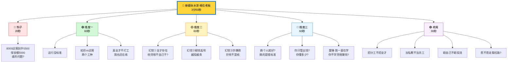

# 🎯 视频思维导图·金字塔结构

## 📝 逐字稿

### 钩子·20秒

> _(正脸对镜头,冷静)_

新媒体运营,
是全网最“玄学”的职位了
水很深，
根在老板。

招聘APP上，光招这个职位都得充值SVIP

但是，在运营眼里：标价8000——面试聊完3500，实际到手还的看老板心情扣点KPI。

(停半拍)

我干了8年新媒体,

这行现在又乱、又累、又穷。

我服务过的老板,**基本都被运营坑过**，而且还不止一次！

最高记录，一连被坑10多W！

今天换个角度,
我想跟各位老板聊聊：**为什么你的钱，注定会打水漂。**

---

第一个真相：**你招的根本不是“运营”，而是你在幻想一个“救世主”。**

在绝大多数老板眼里，运营要会写文案、会拍视频、会剪辑、会投流、还要会卖货。  
（冷笑一声）  
老板，我问你：一个能跑通这一整套闭环的人，他为什么要拿你那三五千块钱的底薪？他自己在家躺着起个号，挣得不比你多吗？

**能出结果的人，在这个时代，绝不打工。**

新媒体是两个逻辑：  
**拍剪是技术工种，运营是销售工种。**  
一个是搞审美的，一个是搞人心的。
自古技术和销售就不对付，你非要这两脑子长在同一个人身上。  
结果就是：你招到了一个“低配版的裁缝”，每天对着爆款缝缝补补，流量全是随机，转化全靠运气。

（语速加快，情绪递增）

第二个真相：**廉价的招聘标准，才是你最大的成本。**

很多老板跟我说：我给底薪三千，剩下靠提成。
视频火了，业务来了，他拿得多，我也赚得多。  
这逻辑听起来很完美，对吧？

**错。大错特错。**

（重音）  
**内容不好，你花再多钱投流，也只是在给平台交“智商税”。**  
官方都说了：内容是1，投流是0。  
老板，如果你招的人根本写不出那个“1”，你后面加再多“0”也是零。

你以为你省了人工工资？  
不，你损失的是：**拍摄的器材费，时间费、还有最昂贵的——转瞬即逝的行业红利。**

第三个真相：**老板的认知天花板，就是账号的生死线。**

我接手过很多被坑了三五次的客户，他们第一反应都是“人不行”。  
但我发现，**人不行，是因为老板的招聘标准和考核标准从一开始就是错的。**

老板们，问自己三个问题：

1. 你是不是觉得只要出钱，这事儿就跟你没关系了？
    
2. 你自己学过短视频底层逻辑吗？你能判断谁专业、谁在忽悠吗？
    
3. 你是想做一个长久的IP，还是只想捞一波块钱？
    

**我干了8年，我发现凡是能做大的账号，老板本人一定是半个专家。**  
你不需要会剪辑，但你得懂审美；
你不需要会写稿，但你得懂业务。  
**你自己都不学，你凭什么指望一个几千块钱招来的小孩，帮你实现企业的转型？**

听到这儿，如果你还没划走，说明你是真想解决问题。  
听我三句劝：

**第一，把“招一个人”的心态，换成“招两个分工”。**  
术业有专攻。
让搞技术的搞技术，让搞运营的搞销售。

**第二，把“运营”当成你的“私教”。**  
别把他当工具人。
他是来帮你跑通路径的，你要在这个过程中，把这套逻辑变成你公司自己的核心竞争力。

**第三，把这份工作当成你的“商学院”。**  
对于员工，这也是我想说的：别只为了那点工资。
老板的产业、老板的焦虑、老板的决策失误，全是你免费的学习素材。

（看镜头，收尾）  
行业很乱，但路很清。  
**乱世里，只有先把自己学明白的老板，才有资格分到红利。**

我是一个讲真话的新媒体运营。  
至于你愿不愿意听实话——咱们评论区见。
