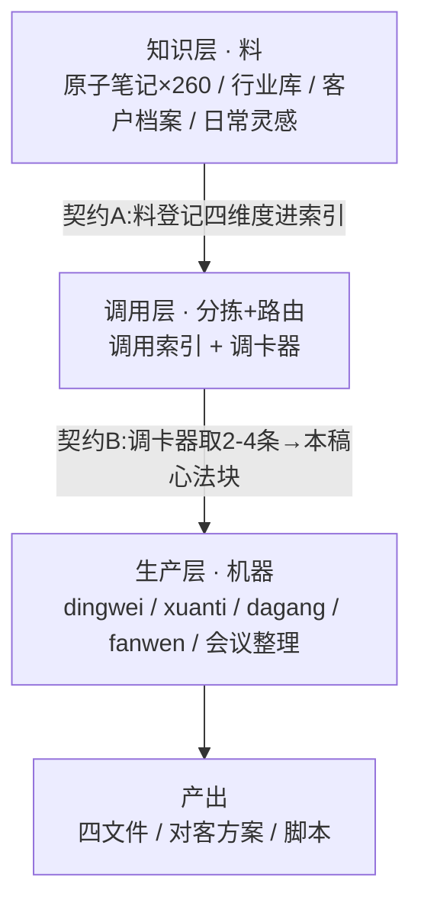

# 系统总图 · OpenClaw 内容生产系统

> 本文件是系统当前架构的全貌(活文档,架构变更时更新本文)。
> 历史轨迹见 [[01-变更日志]]。

## 一句话
这是一个「知识 → 调用 → 生产」的三层系统:料在知识层,调用层按需分拣,生产层产出。

## 架构图

## 三层

### 知识层 · 料
- 职责:存放原料,静态躺着。
- 组件:260 原子笔记、行业库、客户档案、06日常灵感、读书笔记。
- 现状:已就位;约 115 条质检合格待按契约A入库。

### 调用层 · 分拣 + 路由
- 职责:决定"哪条料、什么时候、喂给谁"。
- 组件:调用索引(四维度 + 两级:已验证/待验证)、调卡器(按维度取 2–4 条、只调命中、防淹)。
- 现状:空——当前要搭的框架。接口先冻结、料后灌。

### 生产层 · 机器
- 职责:消费料、产出活。
- 组件:dingwei / xuanti / dagang / fanwen / huiyizhengli。
- 现状:能跑(65分);dagang v3.3、fanwen v4.1 已升。

## 三个接口(契约)——系统的关节,改动前必读
- 契约A(知识→调用):每条料进库时,在调用索引登记四维度——行业 / 内容类型 / 人设点 / 生产线环节。
- 契约B(调用→生产):调卡器按三维度(行业/类型/人设)从索引取最相关 2–4 条料,拼成"本稿心法块"喂入生产线;库再大,单次只读索引 + 命中那几条(防淹)。
- 契约C(生产层内部):dagang 输出"对抗维度"标签 → fanwen 读它落具象画面。

## 贯穿三层的规则
- 四角色:柯哥判断 / Claude 逻辑 / Gemini 文采 / 小龙执行。
- 宪法:备份 → 留痕 → 验证 → 存进系统档案区(本区)。
- 心法:道法术(道少而稳、术多可变)、警惕只增不减、80分先上。

## 施工顺序
1. 搭调用层空框架:定死契约A/B,空库也能挂上生产线空跑。
2. 灌料:质检合格的料按契约A入索引。
3. 接生产线:调卡器按契约B和生产线对接,真稿验证。
4. 持续:新料、新卡、客户档案,都走同一接口进。

## 存档机制(本区怎么用)
- `00-系统总图`(本文):架构当前全貌,变更时更新本文。
- `01-变更日志`:每一步留一条,只增不删,时间倒序。
- 快照(分两级,各归各处):
 - **系统级快照** → `11-系统档案/快照/`:技能(SKILL.md)、调用索引等系统文件被改前的备份。
 - **客户级快照** → 该客户文件夹下的 `_快照/`:某个客户档案被改前的备份,跟着客户走,不进系统档案区。
- 铁律:任何文件被改前,先在"对应那一级"的快照位存一份原文件,带时间戳。

## 锚
每次对话先对一句:现在动的是哪一层?

- [[00柯的账号/肥柯/每日精华/2026-06-19\|2026-06-19 每日精华]]
