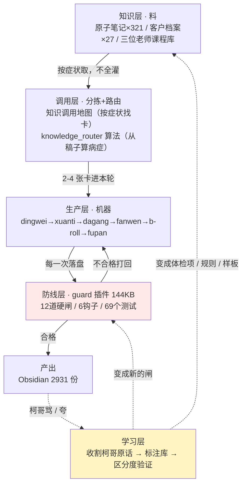

# 系统总图 · OpenClaw 内容生产系统（小龙）

> 本文件是系统当前架构的全貌（活文档，架构变更时更新本文）。
> 历史轨迹见 [[01-变更日志]]。
> **2026-07-27 大修**：上一版停在 06-19，落后 38 天——那时调用层还是空的、guard 还没装、
> 原子笔记还是 260 张。本次数字全部重测，并补上 06-19 之后长出来的两层。
> 更新前原文备份在 `03_备份与日志/系统总图备份-20260727/`。

📖 **细节看唯一那份**：`桌面 › 小龙系统文档 › 小龙.html`
（2026-07-28 六份文档合并为一份——柯哥：「我只要一个啊」。原设计说明书/需求文档已归档到
`03_备份与日志/文档合并-20260728/`。本总图保留，因为它是 Obsidian 内的架构索引。）

---

## 一句话

原来的说法是「知识 → 调用 → 生产」三层。**现在要加两层：防线、学习。**

三层管"怎么把活干出来"；**防线**管"不许把活干砸"；**学习**管"柯哥说过的话怎么变成能力"。
后两层是 07-19 之后长出来的，也是这个月事故降下来、以及"越用越懂柯哥"的直接来源。

## 架构图

---

## 五层现状（2026-07-27 实测数字）

### 知识层 · 料
- **职责**：存原料，静态躺着。
- **组件**：原子笔记 321 张、客户档案 27 个、安/舒/谈三位老师课程库、柯哥自己的方法论。
- **现状**：✅ 就位。⚠️ 但此前五棒技能**只够得着其中 4 张**——不是知识不够，是不会调（07-27 修）。

### 调用层 · 分拣 + 路由
- **06-19 时**：**空**。这是当时最大的缺口。
- **现在**：
  - `02新媒体知识-神经元重塑/🧭 知识调用地图.md` —— 按**症状**索引（"稿子平了""开头抓不住"），不按学科
  - `scripts/knowledge_router.py` —— 借鉴推荐系统的召回+精排：从稿子算病症向量 → 推该读的卡，**全程零模型调用**
- ⚠️ **判据尚不可信**：9 个体检项里 6 项在真实样本上区分度反向，已停用；剩下 3 项当参考不当结论。**标注库只有 6 条，要攒到 20+ 才算数**。

### 生产层 · 机器
- **职责**：消费料、产出活。
- **组件**：五棒流水线 dingwei → xuanti → dagang → fanwen → b-roll → fupan，共 31 个技能。
- **现状**：✅ 能跑。**不许跳棒由代码物理强制**——没有大纲，稿子写不进去。
- **三个卡点必须柯哥拍板**：挑角度 / 认大纲 / 验成稿。

### 防线层 · guard 插件（06-19 时不存在）
- **职责**：不让不合格的东西落盘。
- **组件**：12 道硬闸、5 个工具（vault 唯一读写通道）、6 个钩子、69 个自动化测试。
- **设计原则**：
  1. **物理拦截 > 写在纸上**——写进 SKILL 的规矩，上下文一压缩就忘；写进代码的绕不过
  2. 拦下必须说清怎么改，不能只说"不合格"
  3. 同一个错拦 3 次自动停手报柯哥（多半是闸有 bug，不是它的错）
  4. 🔴 **闸管别写坏，不管别写好**（07-27 新增）——闸和好东西冲突时让柯哥看见，别让闸替他做决定

### 学习层 · 柯哥的话怎么变成能力（06-19 时不存在）
- **收割**：每天自动捞柯哥的点评进收件箱。07-27 修了个大洞——此前只扫小龙侧会话，
  **柯哥对 Claude 说的判断（"wiki链接要有逻辑""我要的是丝滑"）全漏了**。
- **分流**：能量化的 → 体检项 ｜ 要判断的 → 规则 ｜ 是范例的 → 样板
- **验证**：新体检项必须能分开柯哥骂过/夸过的稿子，分不开就作废
- ⚠️ **"话 → 规则"这一步仍靠 Claude 手工**，尚未自动化。

---

## 接口（契约）——系统的关节，改动前必读

- **契约A（知识→调用）**：料进库时登记四维度——行业 / 内容类型 / 人设点 / 生产线环节。
- **契约B（调用→生产）**：按症状取 2–4 条料拼成"本轮心法块"；**库再大，单次只读索引 + 命中那几条（防淹）**。
- **契约C（生产层内部）**：dagang 输出"角度 + 说话态度" → fanwen 读它定全篇口气。
- **契约D（生产→防线，07-19 新增）**：所有 vault 写入必须走 `superfactory_obsidian_*` 工具，shell 直写物理拦截。
- **契约E（产出→学习，07-27 新增）**：柯哥的每句褒贬进标注库，并存**当时的稿子快照**——
  稿子会被改，只记路径会让标注越用越脏。

## 贯穿全系统的规则

- **四角色**：柯哥判断 / Claude 逻辑 / Gemini 文采 / 小龙执行。
- **宪法**：备份 → 留痕 → 验证 → 存进系统档案区（本区）。
- **心法**：道法术（道少而稳、术多可变）、警惕只增不减、80分先上。
- 🔴 **规则预算制（07-25 立）**：加一条新规则必须挤掉一条旧的，**净增长为零**。
  作战包硬顶 34KB 有自动体检——07-27 这条闸第一次拦住了 Claude 自己。
- 🔴 **不许变傻（07-27 立）**：每次写稿开工前固定读取 ≤ 3 万字。现状 2.9 万，**贴着线跑**。

---

## 当前最大的三个风险

1. **开工成本贴顶**：SKILL 33KB + 作战包 34KB 占固定读取的 75%，再加东西就要挤压素材空间。
2. **标注库太薄**：只有 6 条褒贬，任何判据都可能是过拟合——07-27 已经翻过一次车。
3. **它自己悟的存不住**：小龙自己总结的方法（如"叙事者要是正在经历的人"），换个客户可能就忘，仍靠 Claude 手工收。

---

## ⛔ 已作废的文档（别再看，会被误导）

- `workspace/superfactory/ARCHITECTURE-v7.md`（07-14）——描述 **v7 六层架构**，
  而 **v7 已于 07-17 被柯哥叫停回滚到 v6**（原话："质量终于回来了"）。内容与现状不符，仅作考古。
- `10-OpenClaw使用技巧/超级工厂重构与优化指南-2026-07-19.md`——当时的行动计划，
  其中"28 技能判定表"仍有参考价值，行动清单多数已执行完或被后续决策覆盖。

---

## 存档机制（本区怎么用）

- `00-系统总图`（本文）：架构当前全貌，变更时更新本文。
- `01-变更日志`：每一步留一条，只增不删，时间倒序。
- 快照分两级：**系统级** → `11系统档案/快照/`；**客户级** → 该客户文件夹下的 `_快照/`。
- 铁律：任何文件被改前，先在对应那一级的快照位存一份原文件，带时间戳。

## 锚

每次对话先对一句：**现在动的是哪一层？**

- [[00柯的账号/肥柯/每日精华/2026-06-19\|2026-06-19 每日精华]]
