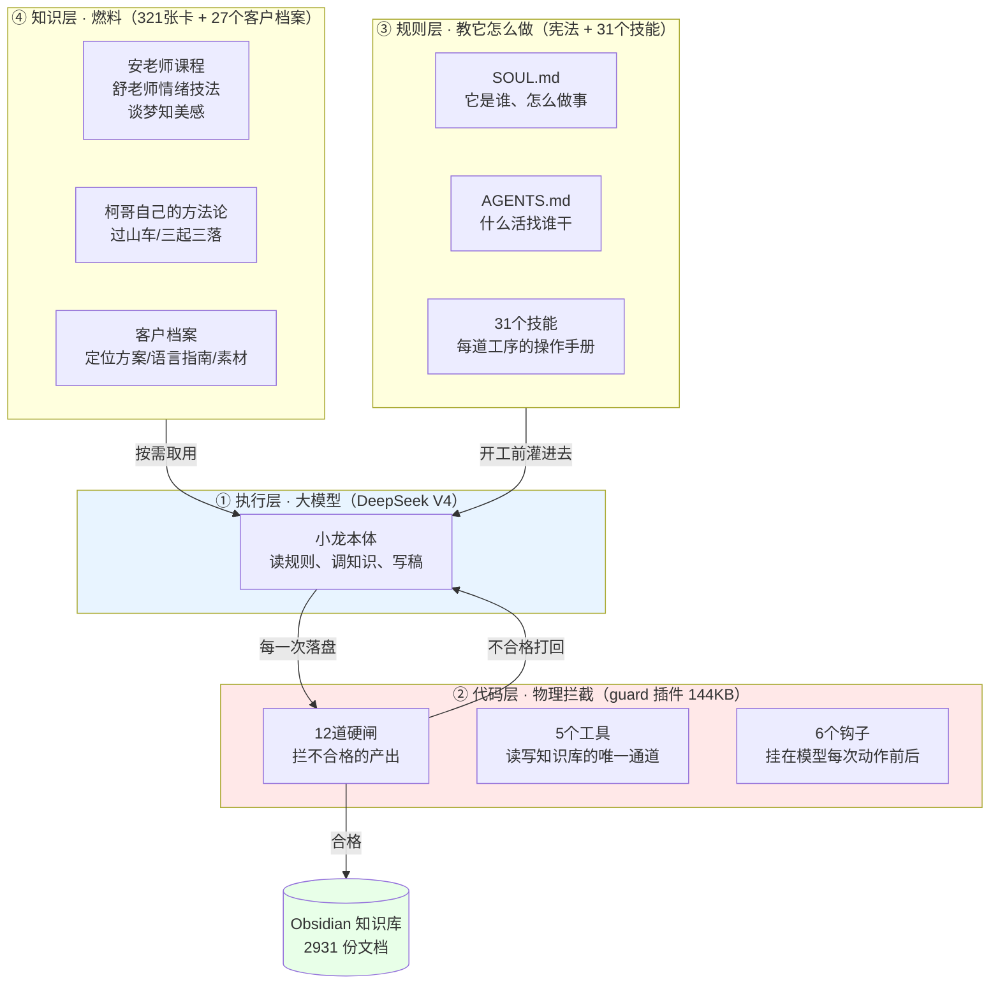
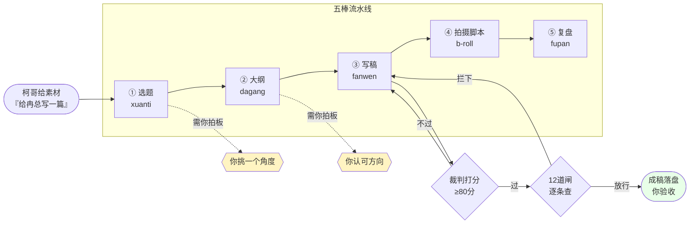
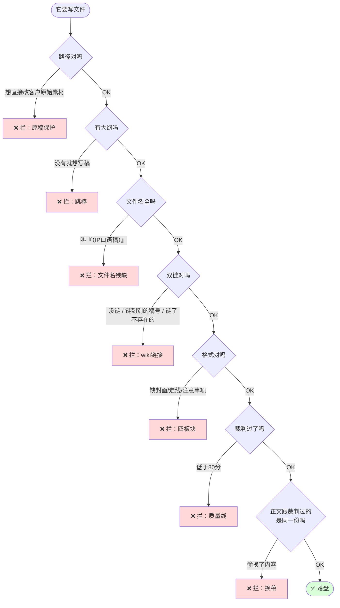
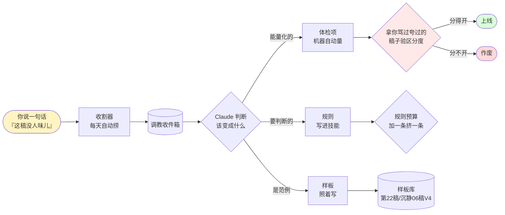

# 小龙 · 设计说明书

> 给柯建军看的，不是给工程师看的。凡是需要懂代码才能看懂的地方，都算我没写好。
> 配套文档：[[小龙-需求文档]]

---

## 一、一句话说清它是什么

**小龙是一条把"柯建军的判断力"复制成流水线的内容生产系统。**

不是一个聊天机器人，不是一个写稿工具。它是**一条产线**：
原始素材从一头进去，能直接开拍的成稿从另一头出来，中间每一道工序都有人（机器）盯着不许偷工减料。

它跟市面上"用 AI 写文案"最大的区别：
**市面上的 AI 是"你问它答"，小龙是"你教它，它记住，下次不用你教"。**

---

## 二、全景图：它由四层组成

**为什么要分四层？**

因为**只靠一层会垮**：

| 只有这一层会怎样 | 实际发生过的事故 |
|---|---|
| 只有大模型 | 它想怎么写就怎么写，今天这样明天那样 |
| 只加规则 | 规则堆到 33KB，**模型看不完就开始忘**（你说的"塞太多就变傻"） |
| 只加代码闸 | 拦得住写坏，拦不出写好（沉静第06稿：闸判 82 分不过，你说"这一版还可以"） |
| 只有知识 | 321 张卡躺在库里，写稿时它一张都想不起来调 |

**四层各管一段，谁也替代不了谁。**

---

## 三、主流程：一条稿子是怎么生出来的

**三个卡点必须你本人点头**（黄色）：选哪个角度、大纲方向对不对、最后成稿认不认。
**其余全自动**。

### 为什么不许跳棒

你 2026-07-22 定的："不管素材厚与不厚，都应该先走选题。"

**跳棒的代价（真实事故）**：一冉集团号第17/18稿直接从素材写稿，出来的东西没角度、平铺直叙。
现在这条由代码强制：**没有大纲，稿子物理写不进去**。它想绕也绕不过。

---

## 四、12 道闸分别在拦什么

闸不是为了刁难它，每一道背后都对应一次真实事故。

**闸的设计原则（吃过亏才定的）**：

1. **物理拦截 > 写在纸上**——写进 SKILL 的规矩，模型上下文一压缩就忘；写进代码的，它绕不过。
2. **拦下必须说清怎么改**——只说"不合格"它会瞎试；报错里必须带"正确写法长什么样"。
3. **同一个错拦三次就停手报你**——2026-07-24 装的断路器。连拦三次多半是闸有 bug，不是它的错。
4. **闸管别写坏，不管别写好**（2026-07-27 新增）——闸和好东西冲突时让你看见，别让闸替你做决定。

---

## 五、你的话是怎么变成它的能力的

这是整个系统最值钱的部分，也是你问过的"能不能越用越聪明"。

**三条出路，为什么要分开**：

- **体检项**（能量化的）：可以无限加，加到 50 条模型也不变傻——**因为它不用背，机器替它量**
- **规则**（要判断的）：有天花板，加一条必须挤掉一条，否则就是你说的"塞太多变傻"
- **样板**（是范例）：最省事也最可靠——照着好稿写，比让机器判分靠谱

**验区分度是关键一环**：一个体检项装不装，不是我说了算，是看它能不能把**你骂过的稿子**和**你夸过的稿子**分开。
2026-07-27 实测：我装的 9 项里 6 项在真实样本上区分度反向，当场全停。**机器审判了我。**

---

## 六、当前规模（2026-07-27）

| 层 | 内容 | 数量 |
|---|---|---|
| 代码层 | guard 插件 | 144 KB，69 个自动化测试 |
| | 硬闸 / 工具 / 钩子 | 12 / 5 / 6 |
| | 运维脚本 | 35 个 |
| 规则层 | 宪法（SOUL+AGENTS+MEMORY） | 26 KB |
| | 技能 | 31 个（写稿工位 SKILL 33KB + 作战包 34KB） |
| 知识层 | 原子笔记 | 321 张 |
| | 客户档案 | 27 个客户 |
| 产出层 | Obsidian 知识库 | 2931 份文档 |
| 自动化 | 定时任务 | 9 个 cron + 6 个常驻 |

**每次写稿，模型开工前先吃掉约 2.9 万字（占它记忆上限的 22%）**——这是当前最大的技术债，详见需求文档 §待办。

---

## 七、已知的边界（做不到的事）

**说清楚做不到什么，比吹能做什么重要。**

1. **它写不出你没教过的好角度**——"给自己鞠一躬"那种切入点，是它偶然想出来的，不是系统保证的。
   **系统能保证不写坏，不能保证写好。**
2. **判断力不能量化**——角度假不假、这选题值不值得做，机器测不出来，只能靠你验收。
   我试过做成判据，2026-07-27 被数据证伪。
3. **它自己悟出来的东西存不住**——沉静第06稿它自己总结出"叙事者要是正在经历的人"，
   这话你没教过，是它想的。但**下次换个客户它可能又忘了**，得我手工收进系统。
4. **换个人用不了**——规则里刻满你的审美、你的客户、你认可的稿子。
   这是它成为**你的**分身的代价，也是它现在还不算产品的原因。

---

## 八、维护须知

| 你要做的 | 频率 |
|---|---|
| 照常骂它 / 夸它（每一句都会进收件箱变成能力） | 随时 |
| 三个卡点拍板：挑角度、认大纲、验成稿 | 每篇 |
| **不用管**：闸、体检、备份、日志、定时任务、模型健康 | — |

| Claude 要做的 | 频率 |
|---|---|
| 把你的话转成体检项/规则/样板 | 随时 |
| 跑区分度验证，作废无效判据 | 每次加新判据 |
| 安全网体检（44 项） | 每天自动 |
| 规则预算：加一条挤一条，作战包不许超 34KB | 每次改规则 |
